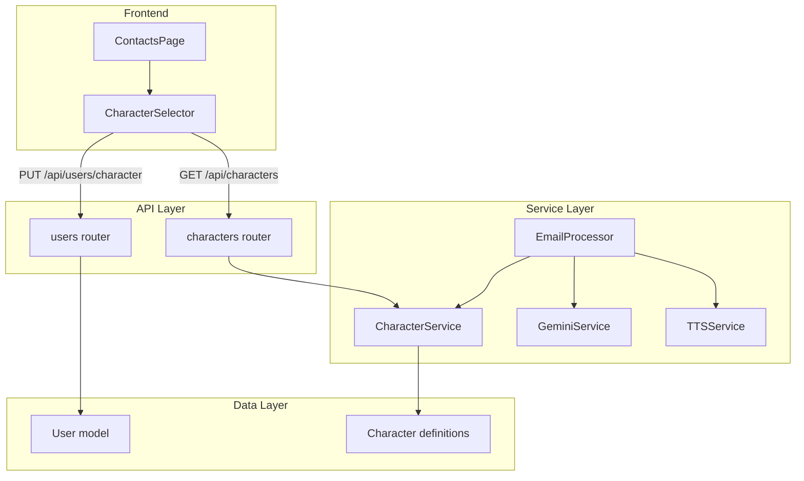
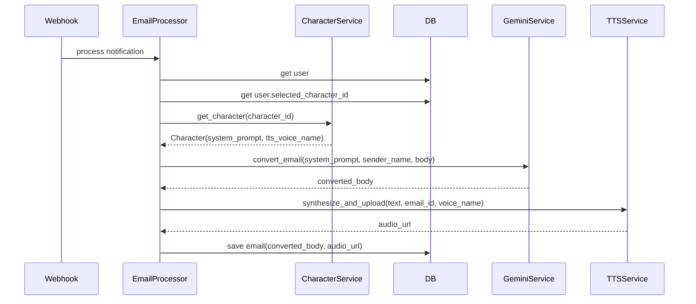

# Design Document: character-selection

## Overview

**Purpose**: メール感情変換のキャラクターを「全肯定ギャル」固定から、事前定義された3キャラクターの選択制に拡張する。ユーザーはキャラクターを選択・変更でき、選択に応じたLLMプロンプトとTTS音声でメールが変換される。

**Users**: TogeNukiユーザーが設定画面でキャラクターを選択し、以降のメール変換・音声読み上げに反映される。

**Impact**: 現在の`GeminiService.convert_to_gyaru()`と`TTSService`のハードコード構造を汎用化し、`User`モデルにキャラクター選択カラムを追加する。

### Goals
- 3キャラクター（全肯定ギャル・優しい先輩・冷静な執事）の定義と選択機能
- ユーザーの選択を永続化し、メール処理パイプラインに反映
- 既存の変換・音声合成ロジックの汎用化

### Non-Goals
- キャラクターのユーザーカスタマイズ（プロンプト編集等）
- キャラクターのDB管理（管理画面での追加・削除）
- 処理済みメールの再変換
- キャラクターごとのアバター画像

## Architecture

### Existing Architecture Analysis

現在のメール処理パイプライン:
1. `EmailProcessorService._process_ai_conversion()` が `GeminiService.convert_to_gyaru()` を呼び出し
2. `convert_to_gyaru()` は `GYARU_SYSTEM_PROMPT` を固定で使用
3. `TTSService` は `config.py` の `tts_voice_name` を固定で使用

変更が必要な箇所（詳細は `gap-analysis.md` 参照）:
- `gemini_service.py`: プロンプトのパラメータ化
- `tts_service.py`: 音声名のパラメータ化
- `email_processor.py`: キャラクター情報の取得と受け渡し
- `models.py`: Userモデルにカラム追加

### Architecture Pattern & Boundary Map



**Architecture Integration**:
- Selected pattern: ハイブリッド（新規CharacterService + 既存サービスの汎用化）
- Domain boundaries: キャラクター定義管理（CharacterService）と変換ロジック（GeminiService/TTSService）を分離
- Existing patterns preserved: Router-Service-Schema、Result型、BackgroundTasks
- Steering compliance: レイヤードアーキテクチャ、サービスオーケストレーション

### Technology Stack

| Layer | Choice / Version | Role in Feature | Notes |
|-------|------------------|-----------------|-------|
| Frontend | React 19, TypeScript | キャラクター選択UI | 既存ContactsPageに統合 |
| Backend | FastAPI, Python 3.10+ | API + ビジネスロジック | 新規router/service追加 |
| Data | PostgreSQL + SQLAlchemy + Alembic | ユーザー選択の永続化 | Userテーブルにカラム追加 |
| AI/TTS | Gemini 2.5 Flash, Cloud TTS Chirp3-HD | キャラクター対応変換 | プロンプト・音声の動的切替 |

## System Flows

### メール処理フロー（キャラクター対応後）



**Key Decisions**: EmailProcessorがCharacterServiceからキャラクター情報を取得し、GeminiService・TTSServiceに適切なパラメータを渡すオーケストレーション役を担う。

## Requirements Traceability

| Requirement | Summary | Components | Interfaces | Flows |
|-------------|---------|------------|------------|-------|
| 1.1 | 3キャラクター定義 | CharacterService | - | - |
| 1.2 | キャラクター属性 | CharacterService | Character dataclass | - |
| 1.3 | コード内定数管理 | CharacterService | - | - |
| 2.1 | 一覧API | CharactersRouter | GET /api/characters | - |
| 2.2 | 認証なしアクセス | CharactersRouter | - | - |
| 3.1 | 選択保存 | UsersRouter, UserModel | PUT /api/users/character | - |
| 3.2 | デフォルトギャル | CharacterService | get_character() fallback | - |
| 3.3 | 変更後の適用 | EmailProcessor | - | メール処理フロー |
| 3.4 | 処理済み不変 | - | - | - |
| 4.1 | キャラクター対応Gemini | GeminiService | convert_email() | メール処理フロー |
| 4.2 | キャラクター対応TTS | TTSService | synthesize_and_upload(voice_name) | メール処理フロー |
| 4.3 | 無効IDフォールバック | CharacterService | get_character() fallback | - |
| 5.1 | 設定画面にセクション | ContactsPage, CharacterSelector | - | - |
| 5.2 | カード選択・保存 | CharacterSelector | PUT /api/users/character | - |
| 5.3 | カード表示 | CharacterSelector | GET /api/characters | - |
| 5.4 | ローディング状態 | CharacterSelector | - | - |

## Components and Interfaces

| Component | Domain/Layer | Intent | Req Coverage | Key Dependencies | Contracts |
|-----------|-------------|--------|--------------|------------------|-----------|
| CharacterService | Backend/Service | キャラクター定義管理と取得 | 1.1-1.3, 3.2, 4.3 | なし | Service |
| CharactersRouter | Backend/Router | キャラクター一覧API | 2.1, 2.2 | CharacterService (P0) | API |
| UsersRouter | Backend/Router | キャラクター選択更新API | 3.1 | UserModel (P0) | API |
| GeminiService | Backend/Service | キャラクター対応メール変換 | 4.1 | Gemini API (P0) | Service |
| TTSService | Backend/Service | キャラクター対応音声合成 | 4.2 | Cloud TTS (P0) | Service |
| EmailProcessor | Backend/Service | 変換パイプラインのオーケストレーション | 3.3, 4.1, 4.2 | CharacterService (P0), GeminiService (P0), TTSService (P0) | Service |
| CharacterSelector | Frontend/Component | キャラクター選択UI | 5.1-5.4 | characters API (P0) | State |
| characters API module | Frontend/API | API呼び出し | 5.2, 5.3 | - | - |

### Backend / Service Layer

#### CharacterService

| Field | Detail |
|-------|--------|
| Intent | キャラクター定義の管理と取得 |
| Requirements | 1.1, 1.2, 1.3, 3.2, 4.3 |

**Responsibilities & Constraints**
- 3キャラクターの定義を`@dataclass(frozen=True)`として保持
- キャラクターIDによる取得、無効ID時のデフォルトフォールバック
- キャラクター一覧の返却

**Dependencies**
- External: なし（コード内定数のみ）

**Contracts**: Service [x]

##### Service Interface
```python
@dataclass(frozen=True)
class Character:
    id: str
    display_name: str
    description: str
    system_prompt: str
    tts_voice_name: str

DEFAULT_CHARACTER_ID: str = "gyaru"

def get_character(character_id: str | None) -> Character:
    """キャラクターIDに対応するキャラクターを返却。
    Noneまたは無効なIDの場合はデフォルト（gyaru）を返却。"""
    ...

def get_all_characters() -> list[Character]:
    """全キャラクターのリストを返却。"""
    ...
```
- Preconditions: なし
- Postconditions: 常に有効な`Character`を返却（フォールバック保証）
- Invariants: 定義済みキャラクターは不変

**Implementation Notes**
- 3キャラクターの定義: `gyaru`（全肯定ギャル）、`senpai`（優しい先輩）、`butler`（冷静な執事）
- 各キャラクターのシステムプロンプトは既存の`GYARU_SYSTEM_PROMPT`と同等の粒度で設計
- TTS音声の暫定割り当て（`research.md`参照）: gyaru=Callirrhoe, senpai=Aoede, butler=Charon

#### GeminiService（拡張）

| Field | Detail |
|-------|--------|
| Intent | システムプロンプトをパラメータ化したメール変換 |
| Requirements | 4.1 |

**Responsibilities & Constraints**
- 既存の`convert_to_gyaru()`を`convert_email()`にリネーム
- `system_prompt`を外部から受け取る
- `Result[str, GeminiError]`の返却パターンは維持

**Dependencies**
- External: Gemini API (P0)

**Contracts**: Service [x]

##### Service Interface
```python
async def convert_email(
    self,
    system_prompt: str,
    sender_name: str,
    original_body: str,
) -> Result[str, GeminiError]:
    """指定されたシステムプロンプトでメール本文を変換する。
    既存のconvert_to_gyaru()を置き換える。"""
    ...
```
- Preconditions: `system_prompt`と`original_body`が非空
- Postconditions: 変換テキストまたはエラーを返却
- Invariants: temperature=0.8、max_output_tokens=1024（既存と同一）

**Implementation Notes**
- `GYARU_SYSTEM_PROMPT`定数は`CharacterService`のgyaruキャラクター定義に移動
- `BUSINESS_REPLY_SYSTEM_PROMPT`と`compose_business_reply()`は変更なし（キャラクター非依存）
- `analyze_patterns()`も変更なし

#### TTSService（拡張）

| Field | Detail |
|-------|--------|
| Intent | 音声名をパラメータ化した音声合成 |
| Requirements | 4.2 |

**Responsibilities & Constraints**
- `synthesize_and_upload()`に`voice_name`オプション引数を追加
- `None`時はSettings値をフォールバック

**Contracts**: Service [x]

##### Service Interface
```python
async def synthesize_and_upload(
    self,
    text: str,
    email_id: UUID,
    voice_name: str | None = None,
) -> Result[str, TTSError]:
    """テキストを音声合成しGCSにアップロード。
    voice_name未指定時はSettings.tts_voice_nameを使用。"""
    ...
```
- Preconditions: `text`が非空
- Postconditions: 音声URLまたはエラーを返却
- Invariants: 音声フォーマットはMP3固定

#### EmailProcessor（拡張）

| Field | Detail |
|-------|--------|
| Intent | キャラクター情報を取得し変換パイプラインに反映 |
| Requirements | 3.3, 4.1, 4.2 |

**Responsibilities & Constraints**
- `_process_ai_conversion()`でUserの`selected_character_id`を参照
- CharacterServiceからキャラクター定義を取得
- GeminiServiceとTTSServiceに適切なパラメータを渡す

**Dependencies**
- Inbound: Webhook handler — メール処理トリガー (P0)
- Outbound: CharacterService — キャラクター取得 (P0), GeminiService — 変換 (P0), TTSService — 音声合成 (P0)

**Contracts**: Service [x]

**Implementation Notes**
- `_process_ai_conversion()`のシグネチャに`User`オブジェクト（または`selected_character_id`）を追加
- `_process_single_message()`から`_process_ai_conversion()`への呼び出しでuser情報を受け渡し

### Backend / Router Layer

#### CharactersRouter

| Field | Detail |
|-------|--------|
| Intent | キャラクター一覧APIエンドポイント |
| Requirements | 2.1, 2.2 |

**Contracts**: API [x]

##### API Contract

| Method | Endpoint | Request | Response | Errors |
|--------|----------|---------|----------|--------|
| GET | /api/characters | - | CharactersListResponse | 500 |

```python
class CharacterResponse(BaseModel):
    id: str
    displayName: str
    description: str

class CharactersListResponse(BaseModel):
    characters: list[CharacterResponse]
```

**Implementation Notes**
- 認証不要（公開API）
- `main.py`に`characters_router`を追加（prefix="/api"）

#### UsersRouter（新規エンドポイント追加）

| Field | Detail |
|-------|--------|
| Intent | ユーザーのキャラクター選択更新 |
| Requirements | 3.1 |

**Contracts**: API [x]

##### API Contract

| Method | Endpoint | Request | Response | Errors |
|--------|----------|---------|----------|--------|
| PUT | /api/users/character | UpdateCharacterRequest | CharacterResponse | 400, 401 |
| GET | /api/users/character | - | CharacterResponse | 401 |

```python
class UpdateCharacterRequest(BaseModel):
    characterId: str

# Response: CharacterResponse（上記と同じ）
```

**Implementation Notes**
- 認証必須（`get_current_user`依存）
- 無効な`characterId`は400エラー
- `routers/users.py`を新規作成、または既存routerに追加

### Frontend / Component Layer

#### CharacterSelector

| Field | Detail |
|-------|--------|
| Intent | キャラクター選択カードUI |
| Requirements | 5.1, 5.2, 5.3, 5.4 |

**Contracts**: State [x]

##### State Management
```typescript
interface Character {
  id: string;
  displayName: string;
  description: string;
}

// Component props
interface CharacterSelectorProps {
  currentCharacterId: string;
  onCharacterChanged: (characterId: string) => void;
}
```

- State model: `characters: Character[]`, `selectedId: string`, `isSaving: boolean`
- Persistence: APIへの即座保存（楽観的UIではなく、保存完了後に反映）

**Implementation Notes**
- `ContactsPage.tsx`に新セクションとして統合
- 各キャラクターをカード形式で表示、選択中のカードをハイライト
- 初回レンダリング時に`GET /api/characters`と`GET /api/users/character`を並列呼び出し

#### characters API module

`api/characters.ts`にAPI呼び出し関数をエクスポート:

```typescript
function fetchCharacters(): Promise<CharactersListResponse>
function fetchCurrentCharacter(idToken: string): Promise<CharacterResponse>
function updateCharacter(idToken: string, characterId: string): Promise<CharacterResponse>
```

## Data Models

### Physical Data Model

**Userテーブルへのカラム追加**:

| Column | Type | Nullable | Default | Description |
|--------|------|----------|---------|-------------|
| selected_character_id | VARCHAR(64) | Yes | NULL | ユーザーが選択したキャラクターID |

- NULLはデフォルトキャラクター（gyaru）として扱う
- 外部キー制約なし（キャラクター定義はコード内定数のため）
- インデックス不要（ユーザー取得時のみ参照）

**Alembicマイグレーション**: `add_selected_character_id_to_users`

### Data Contracts

**キャラクター一覧レスポンス**:
```json
{
  "characters": [
    {
      "id": "gyaru",
      "displayName": "全肯定ギャル",
      "description": "ハイテンションでポジティブなギャルがメールを読み上げます"
    },
    {
      "id": "senpai",
      "displayName": "優しい先輩",
      "description": "穏やかで包容力のある先輩がメールを伝えてくれます"
    },
    {
      "id": "butler",
      "displayName": "冷静な執事",
      "description": "落ち着いた口調の執事がメールを報告します"
    }
  ]
}
```

## Error Handling

### Error Categories and Responses

| Scenario | HTTP Status | Error Code | Handling |
|----------|-------------|------------|---------|
| 無効なcharacterId | 400 | invalid_character_id | キャラクター一覧を参照するようガイド |
| 未認証でのキャラクター更新 | 401 | unauthorized | ログインを要求 |
| 無効なcharacter_idでのメール処理 | - | - | デフォルトキャラクターにフォールバック（サイレント） |
| Gemini API失敗 | - | - | 既存のエラーハンドリング（Result型）を維持 |
| TTS失敗 | - | - | 既存のエラーハンドリング（Result型）を維持 |

## Testing Strategy

### Unit Tests
- CharacterService: `get_character()`のフォールバック動作、`get_all_characters()`の返却値
- GeminiService: `convert_email()`が指定されたsystem_promptを使用すること
- TTSService: `synthesize_and_upload()`がvoice_name引数を正しく反映すること
- CharactersRouter: 認証なしアクセス可能、全キャラクター返却
- UsersRouter: キャラクター更新・取得、無効ID拒否

### Integration Tests
- EmailProcessor: キャラクター取得 → Gemini変換 → TTS音声合成のE2Eフロー
- デフォルトキャラクター: `selected_character_id`がNULLのユーザーでgyaruが適用されること
- キャラクター変更後: 新キャラクターで新規メールが処理されること

### E2E/UI Tests
- キャラクター選択画面の表示、カード選択、保存確認
- 選択状態のページリロード後の永続化確認

## Migration Strategy

1. Alembicマイグレーションで`users.selected_character_id`カラムを追加（NULL許容）
2. 既存ユーザーは全てNULL（=デフォルトのgyaru）
3. `convert_to_gyaru()`から`convert_email()`へのリファクタリング
4. テスト修正（`convert_to_gyaru`参照を`convert_email`に置換）
5. フロントエンドにCharacterSelector追加

全ステップが後方互換のため、段階的にデプロイ可能。ロールバックリスクは低い。
