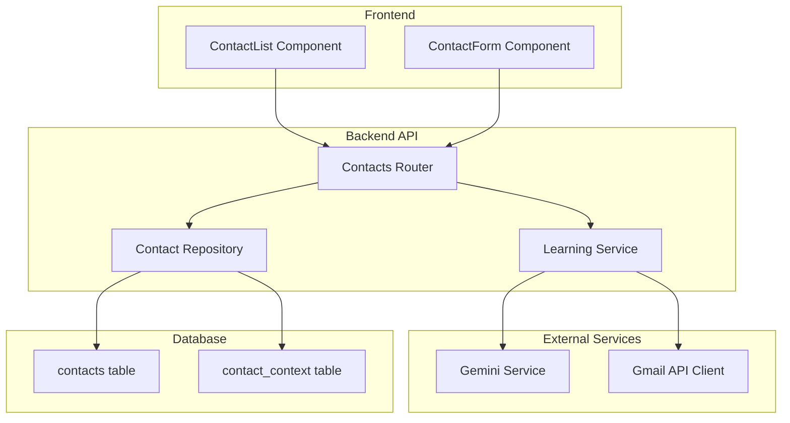
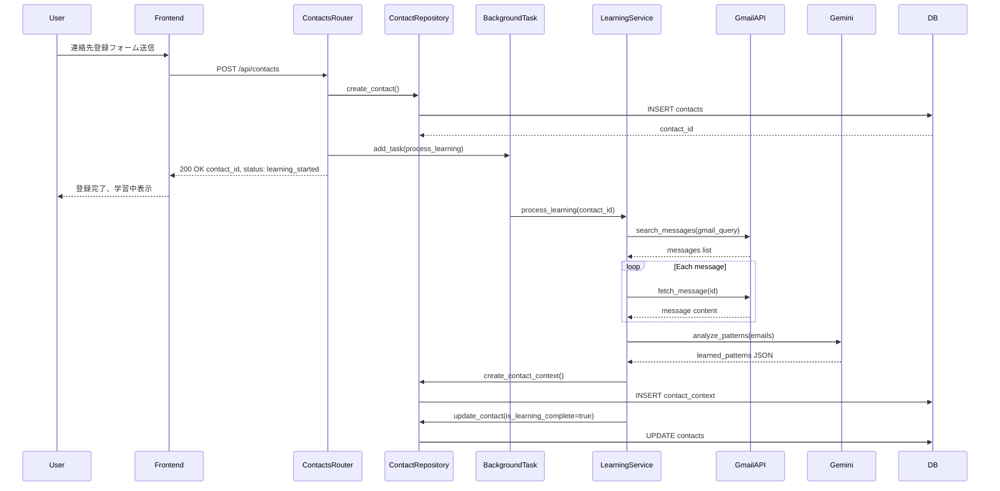
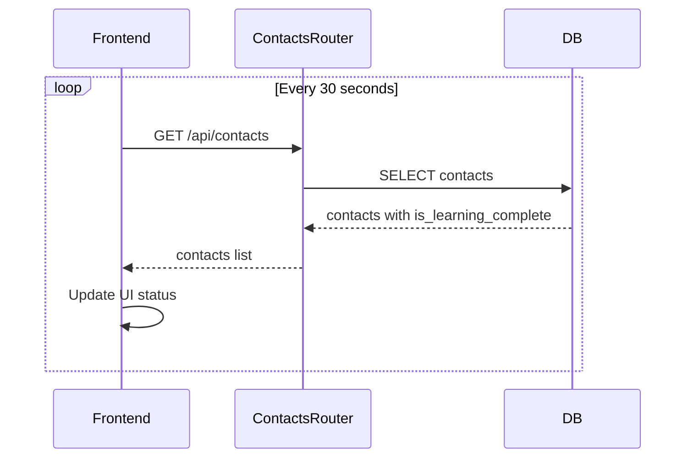

# Design Document: contact-management

## Overview

**Purpose**: 連絡先管理機能は、ユーザーが監視対象の連絡先（上司・取引先など）を登録・管理し、過去メールから相手の特徴とユーザーの返信パターンを学習する機能を提供する。

**Users**: TogeNukiユーザーが連絡先を登録し、その連絡先からのメールのみがギャル語変換・音声読み上げの対象となる。学習データは将来の音声返信機能でパーソナライズされた返信生成に使用される。

**Impact**: 既存の`contacts`テーブルを活用し、新規`contact_context`テーブルを追加。既存の`GeminiService`と`GmailApiClient`を拡張。

### Goals
- 連絡先のCRUD操作（登録・一覧・削除）を提供する
- 連絡先登録時に過去メールを自動取得し、Geminiで学習処理を実行する
- 学習状態をフロントエンドで可視化し、ポーリングで完了通知を実現する

### Non-Goals
- 連絡先の編集機能（初期リリースでは登録・削除のみ）
- WebSocketによるリアルタイム通知（ポーリングで代替）
- 学習データの手動編集機能

## Architecture

### Existing Architecture Analysis

既存システムで活用するコンポーネント:
- **Contact モデル** (`apps/api/src/models.py:51-77`): `is_learning_complete`フラグ含む
- **認証ミドルウェア** (`apps/api/src/auth/middleware.py`): `get_current_user`
- **BackgroundTasks パターン** (`apps/api/src/routers/webhook.py`): 非同期処理
- **GeminiService** (`apps/api/src/services/gemini_service.py`): `Result`型パターン
- **GmailApiClient** (`apps/api/src/services/gmail_service.py`): httpx非同期クライアント

拡張が必要なコンポーネント:
- `GeminiService`: `analyze_patterns()`メソッド追加
- `GmailApiClient`: `search_messages()`メソッド追加

新規作成が必要なコンポーネント:
- `ContactContext`モデルとマイグレーション
- 連絡先APIルーター、リポジトリ、スキーマ
- `LearningService`オーケストレーション
- Frontend連絡先管理UI

### Architecture Pattern & Boundary Map



**Architecture Integration**:
- Selected pattern: レイヤードアーキテクチャ（Router → Service → Repository）
- Domain boundaries: 連絡先管理は独立モジュール、学習処理はServiceで分離
- Existing patterns preserved: `Result`型エラーハンドリング、`BackgroundTasks`非同期処理
- New components rationale: 責務分離とテスト容易性のため
- Steering compliance: FastAPI async/await、SQLAlchemy ORM使用

### Technology Stack

| Layer | Choice / Version | Role in Feature | Notes |
|-------|------------------|-----------------|-------|
| Frontend | React 19 + TypeScript | 連絡先一覧・登録フォーム | 既存パターン踏襲 |
| Backend | FastAPI + Python 3.10+ | REST API、非同期処理 | BackgroundTasks使用 |
| Database | PostgreSQL + SQLAlchemy | 連絡先・学習データ永続化 | contact_context追加 |
| AI | Gemini 2.5 Flash | 過去メール分析 | 学習プロンプト追加 |
| External | Gmail API | 過去メール取得 | search_messages追加 |

## System Flows

### 連絡先登録・学習処理フロー



**Key Decisions**:
- 即座に200 OK返却し、学習処理はBackgroundTasksで非同期実行
- Gmail APIはクエリ検索で過去30件取得、各メッセージを個別fetch
- Geminiは全メールをまとめて分析し、JSON形式で結果を返却

### 学習完了ポーリングフロー



## Requirements Traceability

| Requirement | Summary | Components | Interfaces | Flows |
|-------------|---------|------------|------------|-------|
| 1.1 | 連絡先登録時にDBレコード作成 | ContactRepository | POST /api/contacts | 登録フロー |
| 1.2 | 即座に200 OK返却 | ContactsRouter | POST /api/contacts | 登録フロー |
| 1.3 | メールアドレス・名前・クエリ保存 | ContactRepository, ContactDTO | POST /api/contacts | - |
| 1.4 | 重複登録時409エラー | ContactRepository | POST /api/contacts | - |
| 1.5 | Firebase ID Token認証 | AuthMiddleware | Authorization Header | - |
| 2.1 | 連絡先一覧取得 | ContactsRouter | GET /api/contacts | - |
| 2.2 | メール・名前・学習状態表示 | ContactList | ContactDTO | - |
| 2.3 | 学習中ローディング表示 | ContactList | isLearningComplete | - |
| 2.4 | 学習完了ステータス表示 | ContactList | isLearningComplete | - |
| 2.5 | ユーザー分離 | ContactRepository | user_id filter | - |
| 3.1 | 削除確認ダイアログ | ContactList | onClick handler | - |
| 3.2 | DELETE API呼び出し | ContactList | DELETE /api/contacts/{id} | - |
| 3.3 | 連絡先・contact_context削除 | ContactRepository | DELETE | - |
| 3.4 | 他ユーザー削除時403 | ContactRepository | user_id check | - |
| 3.5 | 存在しない連絡先404 | ContactRepository | existence check | - |
| 4.1 | BackgroundTasksで学習実行 | LearningService | BackgroundTasks | 学習フロー |
| 4.2 | Gmail APIで30件取得 | GmailApiClient | search_messages | 学習フロー |
| 4.3 | Gemini分析リクエスト | GeminiService | analyze_patterns | 学習フロー |
| 4.4 | 特徴・パターン抽出 | GeminiService | LearningPrompt | 学習フロー |
| 4.5 | contact_context保存 | ContactRepository | create_contact_context | 学習フロー |
| 4.6 | is_learning_complete更新 | ContactRepository | update_contact | 学習フロー |
| 4.7 | Gmail APIエラーログ | LearningService | error handling | - |
| 4.8 | Geminiエラーリトライ | LearningService | retry logic | - |
| 5.1 | 30秒ポーリング | ContactList | useEffect | ポーリングフロー |
| 5.2 | UI学習ステータス更新 | ContactList | state update | ポーリングフロー |
| 5.3 | エラー時再試行ボタン | ContactList | retry button | - |
| 6.1 | Firebase Token検証 | AuthMiddleware | get_current_user | - |
| 6.2 | 無効トークン401 | AuthMiddleware | HTTPException | - |
| 6.3 | ユーザー分離 | ContactRepository | user_id filter | - |
| 6.4 | 他ユーザーアクセス403 | ContactsRouter | ownership check | - |

## Components and Interfaces

| Component | Domain/Layer | Intent | Req Coverage | Key Dependencies | Contracts |
|-----------|--------------|--------|--------------|------------------|-----------|
| ContactsRouter | API | 連絡先CRUD APIエンドポイント | 1.1-1.5, 2.1, 2.5, 3.2-3.5, 6.1-6.4 | AuthMiddleware (P0), ContactRepository (P0), LearningService (P1) | API |
| ContactRepository | Data | 連絡先・学習データDB操作 | 1.1, 1.3, 1.4, 2.5, 3.3-3.5, 4.5, 4.6, 6.3 | AsyncSession (P0) | Service |
| LearningService | Service | 学習処理オーケストレーション | 4.1-4.8 | GeminiService (P0), GmailApiClient (P0), ContactRepository (P0) | Service |
| GeminiService拡張 | Service | analyze_patternsメソッド追加 | 4.3, 4.4, 4.8 | genai Client (P0) | Service |
| GmailApiClient拡張 | Service | search_messagesメソッド追加 | 4.2, 4.7 | httpx (P0) | Service |
| ContactList | UI | 連絡先一覧・削除・ポーリング | 2.1-2.4, 3.1, 5.1-5.3 | useAuth (P0) | State |
| ContactForm | UI | 連絡先登録フォーム | 1.5 | useAuth (P0) | State |

### Backend / API Layer

#### ContactsRouter

| Field | Detail |
|-------|--------|
| Intent | 連絡先管理のREST APIエンドポイントを提供 |
| Requirements | 1.1, 1.2, 1.4, 1.5, 2.1, 2.5, 3.2, 3.4, 3.5, 6.1, 6.2, 6.4 |

**Responsibilities & Constraints**
- 連絡先のCRUD操作（Create, Read, Delete）を提供
- Firebase ID Token認証を必須とする
- ユーザーは自分の連絡先のみ操作可能

**Dependencies**
- Inbound: Frontend — API呼び出し (P0)
- Outbound: ContactRepository — DB操作 (P0)
- Outbound: LearningService — 学習処理起動 (P1)
- External: AuthMiddleware — 認証 (P0)

**Contracts**: API [x]

##### API Contract

| Method | Endpoint | Request | Response | Errors |
|--------|----------|---------|----------|--------|
| POST | /api/contacts | ContactCreateRequest | ContactResponse | 400, 401, 409 |
| GET | /api/contacts | - | ContactsListResponse | 401 |
| DELETE | /api/contacts/{id} | - | 204 No Content | 401, 403, 404 |

**Implementation Notes**
- Integration: `BackgroundTasks.add_task()`で学習処理を非同期起動
- Validation: メールアドレス形式、重複チェック
- Risks: 学習処理の長時間実行によるリソース消費

#### ContactRepository

| Field | Detail |
|-------|--------|
| Intent | 連絡先・学習データのDB操作を提供 |
| Requirements | 1.1, 1.3, 1.4, 2.5, 3.3, 3.4, 3.5, 4.5, 4.6, 6.3 |

**Responsibilities & Constraints**
- contacts, contact_contextテーブルのCRUD操作
- ユーザーIDによるデータ分離を保証
- トランザクション境界の管理

**Dependencies**
- Inbound: ContactsRouter, LearningService — DB操作要求 (P0)
- External: AsyncSession — SQLAlchemy (P0)

**Contracts**: Service [x]

##### Service Interface

```python
from uuid import UUID
from sqlalchemy.ext.asyncio import AsyncSession
from src.models import Contact, ContactContext

async def create_contact(
    session: AsyncSession,
    user_id: UUID,
    contact_email: str,
    contact_name: str | None,
    gmail_query: str | None,
) -> Contact:
    """Create new contact record."""

async def get_contacts_by_user_id(
    session: AsyncSession,
    user_id: UUID,
) -> list[Contact]:
    """Get all contacts for a user."""

async def get_contact_by_id(
    session: AsyncSession,
    contact_id: UUID,
) -> Contact | None:
    """Get contact by ID."""

async def delete_contact(
    session: AsyncSession,
    contact_id: UUID,
) -> bool:
    """Delete contact and related contact_context."""

async def create_contact_context(
    session: AsyncSession,
    contact_id: UUID,
    learned_patterns: str,
) -> ContactContext:
    """Create contact context with learned patterns."""

async def update_contact_learning_status(
    session: AsyncSession,
    contact_id: UUID,
    is_complete: bool,
    failed_at: datetime | None = None,
) -> None:
    """Update contact learning status."""
```

- Preconditions: 有効なセッション、存在するuser_id
- Postconditions: DB状態が更新される
- Invariants: user_id + contact_email の一意性

#### LearningService

| Field | Detail |
|-------|--------|
| Intent | 連絡先学習処理のオーケストレーション |
| Requirements | 4.1, 4.2, 4.3, 4.4, 4.5, 4.6, 4.7, 4.8 |

**Responsibilities & Constraints**
- Gmail APIで過去メール取得
- Geminiで分析実行
- 結果をDBに保存
- エラーハンドリングとリトライ

**Dependencies**
- Inbound: ContactsRouter (BackgroundTask) — 学習処理起動 (P0)
- Outbound: ContactRepository — DB操作 (P0)
- External: GeminiService — AI分析 (P0)
- External: GmailApiClient — メール取得 (P0)

**Contracts**: Service [x]

##### Service Interface

```python
from uuid import UUID

async def process_learning(
    contact_id: UUID,
    user_id: UUID,
) -> None:
    """Execute learning process for a contact.

    1. Get contact and user from DB
    2. Fetch past emails using Gmail API
    3. Analyze patterns using Gemini
    4. Save results to contact_context
    5. Update is_learning_complete flag
    """
```

- Preconditions: contact_id存在、ユーザーがGmail連携済み
- Postconditions: contact_context作成、is_learning_complete=true
- Invariants: 処理完了まで is_learning_complete=false

**Implementation Notes**
- Integration: 新規DBセッションを`async for session in get_db()`で作成
- Validation: Gmail OAuth トークン有効性確認
- Risks: Gemini API レートリミット、Gmail API クォータ

### Backend / Service Layer Extensions

#### GeminiService.analyze_patterns()

| Field | Detail |
|-------|--------|
| Intent | 過去メールを分析して相手の特徴とユーザーパターンを抽出 |
| Requirements | 4.3, 4.4, 4.8 |

**Contracts**: Service [x]

##### Service Interface

```python
from result import Result
from src.services.gemini_service import GeminiError

async def analyze_patterns(
    self,
    contact_name: str,
    email_history: list[dict],
) -> Result[str, GeminiError]:
    """Analyze email history and extract patterns.

    Args:
        contact_name: Name of the contact
        email_history: List of email dicts with sender, body, user_reply

    Returns:
        Result containing JSON string with learned_patterns or error
    """
```

**Implementation Notes**
- Integration: 既存の`convert_to_gyaru()`と同じ`asyncio.to_thread()`パターン
- Validation: email_historyが空の場合はエラー
- Risks: 長文入力時のトークン制限

#### GmailApiClient.search_messages()

| Field | Detail |
|-------|--------|
| Intent | クエリでGmailメッセージを検索 |
| Requirements | 4.2, 4.7 |

**Contracts**: Service [x]

##### Service Interface

```python
from typing import Any

async def search_messages(
    self,
    query: str,
    max_results: int = 30,
) -> list[dict[str, Any]]:
    """Search messages using Gmail API query.

    Args:
        query: Gmail search query (e.g., "from:email@example.com")
        max_results: Maximum number of messages to return

    Returns:
        List of message metadata (id, threadId)

    Raises:
        GmailApiError: If API call fails
    """
```

**Implementation Notes**
- Integration: 既存の`list_recent_messages()`を参考に`q`パラメータ追加
- Validation: クエリ文字列のサニタイズ
- Risks: レートリミット、クエリ構文エラー

### Frontend / UI Layer

#### ContactList

| Field | Detail |
|-------|--------|
| Intent | 連絡先一覧表示、削除、ポーリング |
| Requirements | 2.1, 2.2, 2.3, 2.4, 3.1, 5.1, 5.2, 5.3 |

**Responsibilities & Constraints**
- GET /api/contacts で連絡先一覧取得
- 学習状態に応じたUI表示
- 30秒間隔でポーリング
- 削除確認ダイアログ

**Dependencies**
- Inbound: App — ルーティング (P0)
- External: useAuth — ID Token取得 (P0)
- External: fetch API — HTTP通信 (P0)

**Contracts**: State [x]

##### State Management

```typescript
interface ContactListState {
  contacts: Contact[];
  isLoading: boolean;
  error: string | null;
}

interface Contact {
  id: string;
  contactEmail: string;
  contactName: string | null;
  isLearningComplete: boolean;
  learningFailedAt: string | null;
  createdAt: string;
}
```

- State model: React useState
- Persistence: なし（API経由で取得）
- Concurrency: useEffectで30秒ポーリング

**Implementation Notes**
- Integration: useAuthからidTokenを取得してAPI呼び出し
- Validation: 削除前に確認ダイアログ表示
- Risks: ポーリング中のネットワークエラー

#### ContactForm

| Field | Detail |
|-------|--------|
| Intent | 連絡先登録フォーム |
| Requirements | 1.5 |

**Responsibilities & Constraints**
- メールアドレス（必須）、名前（任意）、Gmail検索クエリ（任意）入力
- POST /api/contacts でバックエンドに送信
- 送信後はContactListを更新

**Contracts**: State [x]

##### State Management

```typescript
interface ContactFormState {
  contactEmail: string;
  contactName: string;
  gmailQuery: string;
  isSubmitting: boolean;
  error: string | null;
}

interface ContactCreateRequest {
  contactEmail: string;
  contactName?: string;
  gmailQuery?: string;
}
```

**Implementation Notes**
- Integration: 送信成功後にContactListをリフレッシュ
- Validation: メールアドレス形式チェック（フロントエンド）

## Data Models

### Domain Model

```mermaid
erDiagram
    User ||--o{ Contact : has
    Contact ||--o| ContactContext : has
    Contact ||--o{ Email : receives

    User {
        uuid id PK
        string firebase_uid UK
        string email
        string gmail_refresh_token
    }

    Contact {
        uuid id PK
        uuid user_id FK
        string contact_email
        string contact_name
        string gmail_query
        boolean is_learning_complete
        datetime learning_failed_at
    }

    ContactContext {
        uuid id PK
        uuid contact_id FK UK
        text learned_patterns
        datetime updated_at
    }
```

**Business Rules**:
- 1ユーザーにつき同一メールアドレスの連絡先は1つのみ
- ContactContextはContactと1:1の関係
- 連絡先削除時、ContactContextは削除、Emailは`contact_id=NULL`に更新

### Physical Data Model

#### contact_context テーブル（新規）

```sql
CREATE TABLE contact_context (
    id UUID PRIMARY KEY DEFAULT uuid_generate_v7(),
    contact_id UUID NOT NULL UNIQUE REFERENCES contacts(id) ON DELETE CASCADE,
    learned_patterns TEXT NOT NULL,
    updated_at TIMESTAMP WITH TIME ZONE DEFAULT NOW() NOT NULL
);

CREATE INDEX idx_contact_context_contact_id ON contact_context(contact_id);
```

#### contacts テーブル変更

```sql
ALTER TABLE contacts
ADD COLUMN learning_failed_at TIMESTAMP WITH TIME ZONE;
```

### Data Contracts & Integration

#### ContactCreateRequest

```typescript
interface ContactCreateRequest {
  contactEmail: string;      // 必須、メールアドレス形式
  contactName?: string;      // 任意、最大255文字
  gmailQuery?: string;       // 任意、最大512文字
}
```

#### ContactResponse

```typescript
interface ContactResponse {
  id: string;
  contactEmail: string;
  contactName: string | null;
  gmailQuery: string | null;
  isLearningComplete: boolean;
  learningFailedAt: string | null;
  createdAt: string;
  status: 'learning_started' | 'learning_complete' | 'learning_failed';
}
```

#### ContactsListResponse

```typescript
interface ContactsListResponse {
  contacts: ContactResponse[];
  total: number;
}
```

#### LearnedPatterns JSON Schema

```json
{
  "contactCharacteristics": {
    "tone": "string - 語調の特徴",
    "commonExpressions": ["string - よく使う表現"],
    "requestPatterns": ["string - 要求パターン"]
  },
  "userReplyPatterns": {
    "responseStyle": "string - 対応スタイル",
    "commonExpressions": ["string - よく使う表現"],
    "formalityLevel": "string - 丁寧さのレベル"
  }
}
```

## Error Handling

### Error Categories and Responses

| Category | Error | HTTP Status | Response | Recovery |
|----------|-------|-------------|----------|----------|
| User | 無効なメールアドレス形式 | 400 | `{error: "invalid_email"}` | フィールド修正 |
| User | 重複連絡先 | 409 | `{error: "duplicate_contact"}` | 既存連絡先確認 |
| User | 未認証 | 401 | `{error: "unauthorized"}` | 再ログイン |
| User | 権限なし | 403 | `{error: "forbidden"}` | - |
| User | 連絡先不存在 | 404 | `{error: "not_found"}` | 一覧リフレッシュ |
| System | Gmail API エラー | - (Background) | ログ記録、`learning_failed_at`設定 | 再試行ボタン |
| System | Gemini API エラー | - (Background) | ログ記録、リトライ（最大3回） | 再試行ボタン |
| System | DB エラー | 500 | `{error: "internal_error"}` | リトライ |

### Monitoring

- 学習処理の成功/失敗率をログに記録
- Gemini API, Gmail APIのエラー率をモニタリング
- BackgroundTaskの実行時間を計測

## Testing Strategy

### Unit Tests
- `ContactRepository`: CRUD操作、重複チェック、ユーザー分離
- `LearningService`: 学習フロー、エラーハンドリング
- `GeminiService.analyze_patterns()`: プロンプト生成、レスポンスパース
- `GmailApiClient.search_messages()`: クエリ構築、レスポンス処理

### Integration Tests
- 連絡先登録 → 学習処理 → 完了フロー
- 認証フロー（Firebase Token検証）
- 重複登録エラーフロー
- 削除フロー（ContactContext連携）

### E2E/UI Tests
- 連絡先登録フォーム送信
- 連絡先一覧表示・ポーリング
- 削除確認ダイアログ
- エラー表示・再試行

## Security Considerations

- **認証**: すべてのAPIエンドポイントでFirebase ID Token検証必須
- **認可**: ユーザーは自分の連絡先のみ操作可能（user_idチェック）
- **データ保護**: Gmail OAuth トークンは暗号化保存（既存実装に準拠）
- **入力検証**: メールアドレス形式、文字列長制限

## Performance & Scalability

- **学習処理時間**: 30件メール取得 + Gemini分析で約30秒〜1分想定
- **ポーリング負荷**: 30秒間隔、軽量なGET /api/contacts
- **Gmail API クォータ**: 1日10億クエリ（問題なし）
- **Gemini API レートリミット**: 1分あたり60リクエスト（連続登録に注意）
