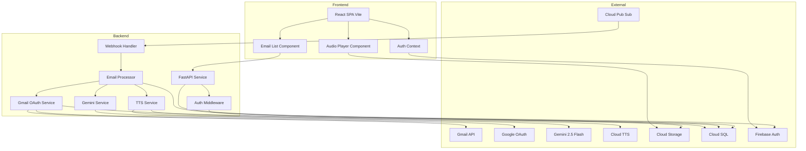
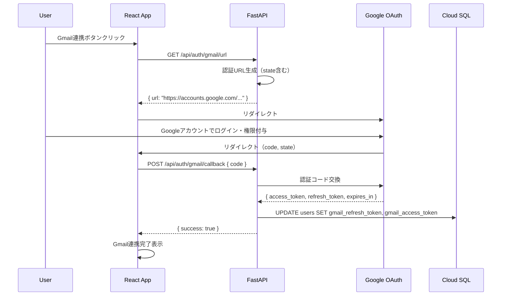
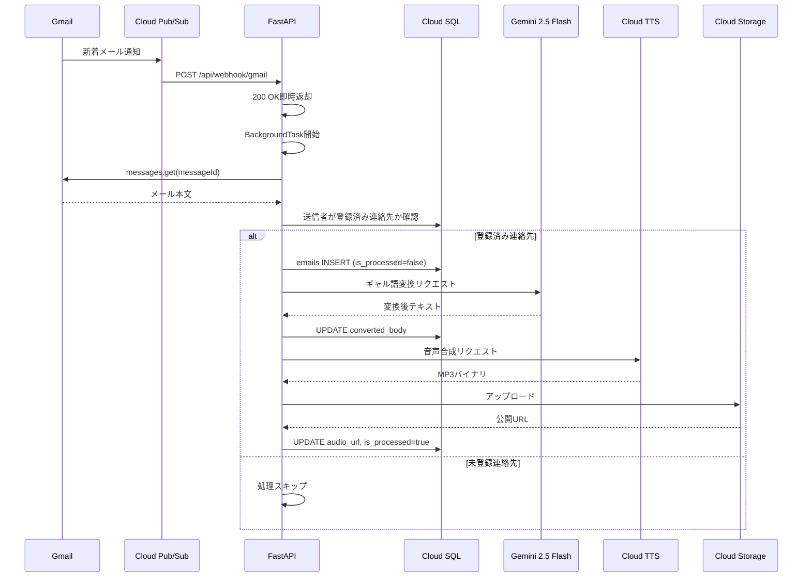
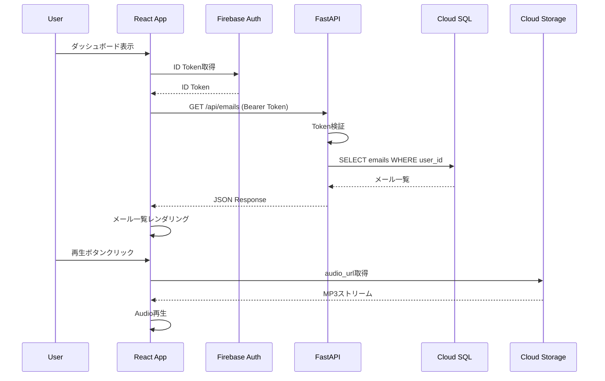
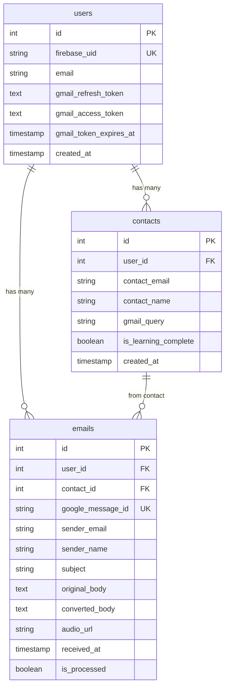

# Technical Design: email-voice-playback

## Overview

**Purpose**: 本機能は、登録済み連絡先からのメールを「全肯定ギャル」口調に変換し、音声で読み上げることで、リモートワーク環境でのメールストレスを軽減する。

**Users**: メール受信に心理的負担を感じるリモートワーカーが、ダッシュボードでメールを音声視聴し、ストレスなく内容を把握できる。

**Impact**: 新規機能のため既存システムへの影響なし。Gmail API、Gemini、Cloud TTSの外部サービス統合が必要。

### Goals
- Gmail新着メールのリアルタイム検知・取得
- LLMによるギャル語変換と音声合成
- ダッシュボードでの音声再生機能
- Firebase認証によるセキュアなアクセス制御

### Non-Goals
- メール返信機能（別specで対応）
- 連絡先登録・学習機能（別specで対応）
- リアルタイム通知（プッシュ通知）
- オフライン対応

## Architecture

### Architecture Pattern & Boundary Map



**Architecture Integration**:
- **Selected pattern**: Layered Architecture + Event-Driven（Pub/Sub部分）
- **Domain boundaries**: Frontend（UI/状態管理）、Backend（ビジネスロジック/外部サービス統合）、External（外部API）
- **Existing patterns preserved**: モノレポ構成、React hooks、FastAPI async/await
- **New components rationale**: 各外部サービスへのアダプターを独立したServiceとして実装
- **Steering compliance**: TypeScript型安全性、Python型ヒント、非同期処理優先

### Technology Stack

| Layer | Choice / Version | Role in Feature | Notes |
|-------|------------------|-----------------|-------|
| Frontend | React 19 + TypeScript | SPA、メール一覧表示、音声再生 | Vite |
| Backend | FastAPI + Python 3.10+ | API、Webhook、ビジネスロジック | async/await必須 |
| Data | Cloud SQL (PostgreSQL) | emails, usersテーブル | SQLAlchemy ORM |
| Storage | Cloud Storage | 音声ファイル保存 | 公開URL発行 |
| Messaging | Cloud Pub/Sub | Gmail Push通知受信 | Webhook Push |
| AI/LLM | Gemini 2.5 Flash | ギャル語変換 | google-genai SDK |
| AI/TTS | Cloud TTS | 音声合成 | WaveNet-B (ja-JP) |
| Auth | Firebase Auth | Google Sign-In | ID Token検証 |
| Infra | Cloud Run | コンテナホスティング | Dockerデプロイ |

## System Flows

### Gmail OAuth認証フロー（初回セットアップ）



**Key Decisions**:
- サーバーサイドOAuthでRefresh Tokenを安全に管理
- stateパラメータでCSRF対策
- Access Token期限切れ時は自動更新

### メール受信・処理フロー



**Key Decisions**:
- Pub/Sub通知受信後は即座に200 OKを返し、BackgroundTasksで非同期処理
- 未登録連絡先からのメールは処理をスキップ
- 各段階でDBを更新し、処理状態を追跡可能に

### ダッシュボード表示・音声再生フロー



## Requirements Traceability

| Requirement | Summary | Components | Interfaces | Flows |
|-------------|---------|------------|------------|-------|
| 1.1 | Pub/Sub通知受信 | WebhookHandler | POST /api/webhook/gmail | メール処理フロー |
| 1.2 | 即時200 OK返却 | WebhookHandler | - | メール処理フロー |
| 1.3 | Gmail API本文取得 | EmailProcessor, GmailOAuthService | GmailService | OAuth認証フロー, メール処理フロー |
| 1.4 | 未登録連絡先スキップ | EmailProcessor | ContactRepository | メール処理フロー |
| 1.5 | emailsテーブル作成 | EmailProcessor | EmailRepository | メール処理フロー |
| 2.1-2.7 | ギャル語変換 | GeminiService | GeminiAdapter | メール処理フロー |
| 3.1-3.6 | 音声合成・GCS保存 | TTSService | TTSAdapter, GCSAdapter | メール処理フロー |
| 4.1-4.5 | ダッシュボード表示 | EmailList, EmailCard | GET /api/emails | ダッシュボードフロー |
| 5.1-5.5 | 音声再生 | AudioPlayer | - | ダッシュボードフロー |
| 6.1-6.5 | 認証・認可 | AuthContext, AuthMiddleware, GmailOAuthService | Firebase Auth, Google OAuth | OAuth認証フロー, 両フロー |

## Components and Interfaces

| Component | Domain/Layer | Intent | Req Coverage | Key Dependencies | Contracts |
|-----------|--------------|--------|--------------|------------------|-----------|
| WebhookHandler | Backend/Controller | Pub/Sub通知受信 | 1.1, 1.2 | EmailProcessor (P0) | API |
| EmailProcessor | Backend/Service | メール処理オーケストレーション | 1.3-1.5, 2.1, 3.1 | GmailService, GeminiService, TTSService (P0) | Service |
| GmailOAuthService | Backend/Service | Gmail API OAuth管理 | 1.3, 6.1-6.5 | Google OAuth (P0), UserRepository (P0) | Service, API |
| GeminiService | Backend/Service | ギャル語変換 | 2.1-2.7 | Gemini API (P0) | Service |
| TTSService | Backend/Service | 音声合成 | 3.1-3.6 | Cloud TTS, GCS (P0) | Service |
| AuthMiddleware | Backend/Middleware | トークン検証 | 6.3-6.5 | Firebase Admin (P0) | Service |
| EmailList | Frontend/Component | メール一覧表示 | 4.1-4.5 | AuthContext (P0), API (P0) | State |
| AudioPlayer | Frontend/Component | 音声再生UI | 5.1-5.5 | GCS (P0) | State |
| AuthContext | Frontend/Context | 認証状態管理 | 6.1-6.2 | Firebase Auth (P0) | State |

### Backend Layer

#### WebhookHandler

| Field | Detail |
|-------|--------|
| Intent | Pub/Sub Push通知を受信し、メール処理を開始する |
| Requirements | 1.1, 1.2 |

**Responsibilities & Constraints**
- Pub/Sub通知の受信と即時応答
- BackgroundTasksへの処理委譲
- 重複通知の検出（historyIdベース）

**Dependencies**
- Outbound: EmailProcessor — メール処理開始 (P0)

**Contracts**: API [x]

##### API Contract
| Method | Endpoint | Request | Response | Errors |
|--------|----------|---------|----------|--------|
| POST | /api/webhook/gmail | PubSubMessage | 200 OK | 400 |

```python
class PubSubMessage(BaseModel):
    message: PubSubData
    subscription: str

class PubSubData(BaseModel):
    data: str  # Base64 encoded
    messageId: str
    publishTime: str
```

**Implementation Notes**
- Pub/Subは10秒以内の応答を期待、即座に200を返す
- `message.data`はBase64デコード後にhistoryIdを取得

---

#### EmailProcessor

| Field | Detail |
|-------|--------|
| Intent | メール取得から音声生成までの処理をオーケストレーションする |
| Requirements | 1.3, 1.4, 1.5, 2.1, 3.1 |

**Responsibilities & Constraints**
- Gmail APIからメール本文を取得
- 送信者が登録済み連絡先かを検証
- GeminiService、TTSServiceを順次呼び出し
- 各段階でDBを更新

**Dependencies**
- Inbound: WebhookHandler — BackgroundTaskから呼び出し (P0)
- Outbound: GmailService — メール取得 (P0)
- Outbound: GeminiService — ギャル語変換 (P0)
- Outbound: TTSService — 音声合成 (P0)
- Outbound: EmailRepository — DB操作 (P0)

**Contracts**: Service [x]

##### Service Interface
```python
class EmailProcessorService(Protocol):
    async def process_new_email(
        self,
        user_id: int,
        history_id: str
    ) -> Result[EmailProcessResult, EmailProcessError]:
        """
        新着メールを処理し、ギャル語変換と音声生成を行う

        Preconditions:
        - user_idが有効なユーザーID
        - history_idがGmail APIで有効

        Postconditions:
        - 登録済み連絡先の場合: emailsテーブルにレコード作成
        - 未登録連絡先の場合: 処理スキップ
        """
        ...

class EmailProcessResult(TypedDict):
    email_id: int
    is_processed: bool
    audio_url: str | None

class EmailProcessError(Enum):
    GMAIL_API_ERROR = "gmail_api_error"
    GEMINI_ERROR = "gemini_error"
    TTS_ERROR = "tts_error"
    CONTACT_NOT_FOUND = "contact_not_found"
```

**Implementation Notes**
- リトライロジックは各Serviceで実装（指数バックオフ）
- エラー時はDBにエラー状態を記録し、ログ出力

---

#### GeminiService

| Field | Detail |
|-------|--------|
| Intent | メール本文をギャル語に変換する |
| Requirements | 2.1, 2.2, 2.3, 2.4, 2.5, 2.6, 2.7 |

**Responsibilities & Constraints**
- Gemini 2.5 Flash APIへのリクエスト
- システムプロンプトの管理
- エラーハンドリングとリトライ

**Dependencies**
- External: Gemini 2.5 Flash API (P0)

**Contracts**: Service [x]

##### Service Interface
```python
class GeminiService(Protocol):
    async def convert_to_gyaru(
        self,
        sender_name: str,
        original_body: str
    ) -> Result[str, GeminiError]:
        """
        メール本文をギャル語に変換する

        Preconditions:
        - original_bodyが空でない

        Postconditions:
        - 変換後テキストを返却
        - エラー時はGeminiErrorを返却
        """
        ...

class GeminiError(Enum):
    RATE_LIMIT = "rate_limit"
    API_ERROR = "api_error"
    TIMEOUT = "timeout"
```

**Implementation Notes**
- プロンプトは定数として管理（ARCHITECTURE.md参照）
- `sender_name`をプロンプトに埋め込み（「〇〇さん」）

---

#### TTSService

| Field | Detail |
|-------|--------|
| Intent | ギャル語テキストを音声に変換しGCSに保存する |
| Requirements | 3.1, 3.2, 3.3, 3.4, 3.5, 3.6 |

**Responsibilities & Constraints**
- Cloud TTS APIへのリクエスト
- MP3形式でGCSにアップロード
- 公開URLの生成

**Dependencies**
- External: Cloud TTS API (P0)
- External: Cloud Storage (P0)

**Contracts**: Service [x]

##### Service Interface
```python
class TTSService(Protocol):
    async def synthesize_and_upload(
        self,
        text: str,
        email_id: int
    ) -> Result[str, TTSError]:
        """
        テキストを音声合成しGCSにアップロードする

        Preconditions:
        - textが空でない

        Postconditions:
        - GCS公開URLを返却
        - エラー時はTTSErrorを返却
        """
        ...

class TTSError(Enum):
    API_ERROR = "api_error"
    UPLOAD_ERROR = "upload_error"
    TIMEOUT = "timeout"
```

**Implementation Notes**
- 音声: `ja-JP-Wavenet-B`（初期）
- ファイル名: `{email_id}_{timestamp}.mp3`
- GCSバケットは公開設定（ハッカソン簡易策）

---

#### AuthMiddleware

| Field | Detail |
|-------|--------|
| Intent | Firebase ID Tokenを検証しユーザー情報を取得する |
| Requirements | 6.3, 6.4, 6.5 |

**Responsibilities & Constraints**
- Authorizationヘッダーからトークン抽出
- firebase-adminでトークン検証
- ユーザーID（firebase_uid）の取得

**Dependencies**
- External: Firebase Admin SDK (P0)

**Contracts**: Service [x]

##### Service Interface
```python
from fastapi import Depends
from fastapi.security import HTTPBearer, HTTPAuthorizationCredentials

class AuthMiddleware:
    async def get_current_user(
        self,
        cred: HTTPAuthorizationCredentials = Depends(HTTPBearer())
    ) -> Result[FirebaseUser, AuthError]:
        """
        Firebase ID Tokenを検証しユーザー情報を返す

        Preconditions:
        - Authorization: Bearer <token> ヘッダーが存在

        Postconditions:
        - 有効なトークン: FirebaseUserを返却
        - 無効なトークン: 401 Unauthorized
        """
        ...

class FirebaseUser(TypedDict):
    uid: str
    email: str

class AuthError(Enum):
    INVALID_TOKEN = "invalid_token"
    EXPIRED_TOKEN = "expired_token"
    MISSING_TOKEN = "missing_token"
```

---

#### GmailOAuthService

| Field | Detail |
|-------|--------|
| Intent | Gmail API用のOAuthトークンをサーバーサイドで管理する |
| Requirements | 1.3, 6.1-6.5 |

**Responsibilities & Constraints**
- OAuth認証URLの生成
- 認証コードからRefresh Token/Access Tokenを取得
- Access Tokenの自動更新（期限切れ時）
- トークンのDB永続化

**Dependencies**
- External: Google OAuth 2.0 API (P0)
- Outbound: UserRepository — トークン保存 (P0)

**Contracts**: Service [x] / API [x]

##### Service Interface
```python
class GmailOAuthService(Protocol):
    def get_authorization_url(self, state: str) -> str:
        """
        OAuth認証URLを生成する

        Postconditions:
        - Gmail API scopesを含む認証URLを返却
        """
        ...

    async def exchange_code_for_tokens(
        self,
        code: str,
        user_id: int
    ) -> Result[OAuthTokens, OAuthError]:
        """
        認証コードをトークンに交換しDBに保存する

        Preconditions:
        - codeが有効なOAuth認証コード

        Postconditions:
        - usersテーブルにトークン情報を保存
        """
        ...

    async def get_valid_access_token(
        self,
        user_id: int
    ) -> Result[str, OAuthError]:
        """
        有効なAccess Tokenを取得する（期限切れの場合は自動更新）

        Preconditions:
        - user_idにRefresh Tokenが紐づいている

        Postconditions:
        - 有効なAccess Tokenを返却
        - 更新された場合はDBも更新
        """
        ...

class OAuthTokens(TypedDict):
    access_token: str
    refresh_token: str
    expires_at: datetime

class OAuthError(Enum):
    INVALID_CODE = "invalid_code"
    TOKEN_REFRESH_FAILED = "token_refresh_failed"
    NO_REFRESH_TOKEN = "no_refresh_token"
```

##### API Contract
| Method | Endpoint | Request | Response | Errors |
|--------|----------|---------|----------|--------|
| GET | /api/auth/gmail/url | - | `{ "url": string }` | 500 |
| POST | /api/auth/gmail/callback | `{ "code": string }` | `{ "success": boolean }` | 400, 401 |
| GET | /api/auth/gmail/status | - | `{ "connected": boolean }` | 401 |

**Implementation Notes**
- OAuth Scopes: `gmail.readonly`, `gmail.send`
- Refresh Tokenは暗号化してDB保存（本番環境）
- Access Token有効期限: 1時間（Google標準）
- トークン更新失敗時はユーザーに再認証を促す

### Frontend Layer

#### AuthContext

| Field | Detail |
|-------|--------|
| Intent | Firebase認証状態をアプリ全体で管理する |
| Requirements | 6.1, 6.2 |

**Responsibilities & Constraints**
- Google Sign-Inフローの管理
- ID Tokenの取得・更新
- 認証状態のグローバル共有

**Dependencies**
- External: Firebase Auth SDK (P0)

**Contracts**: State [x]

##### State Management
```typescript
interface AuthState {
  user: FirebaseUser | null;
  idToken: string | null;
  isGmailConnected: boolean;
  isLoading: boolean;
  error: AuthError | null;
}

interface FirebaseUser {
  uid: string;
  email: string;
  displayName: string | null;
}

interface AuthContextValue extends AuthState {
  signInWithGoogle: () => Promise<void>;
  signOut: () => Promise<void>;
  refreshToken: () => Promise<string>;
  connectGmail: () => Promise<void>;
  checkGmailStatus: () => Promise<boolean>;
}
```

**Implementation Notes**
- `onAuthStateChanged`で認証状態を監視
- Firebase ID Tokenは1時間で期限切れ、自動更新を実装
- Gmail連携状態は`/api/auth/gmail/status`で確認
- Gmail未連携の場合は連携フローへ誘導

---

#### EmailList

| Field | Detail |
|-------|--------|
| Intent | 変換済みメール一覧を表示する |
| Requirements | 4.1, 4.2, 4.3, 4.4, 4.5 |

**Responsibilities & Constraints**
- `/api/emails`からメール一覧を取得
- 受信日時の降順でソート
- 処理中メールにはローディング表示

**Dependencies**
- Inbound: AuthContext — ID Token取得 (P0)
- Outbound: Backend API — メール一覧取得 (P0)

**Contracts**: State [x]

##### State Management
```typescript
interface EmailListState {
  emails: Email[];
  isLoading: boolean;
  error: string | null;
}

interface Email {
  id: number;
  senderName: string;
  senderEmail: string;
  subject: string;
  convertedBody: string;
  audioUrl: string | null;
  isProcessed: boolean;
  receivedAt: string;
}
```

**Implementation Notes**
- ポーリングまたはマニュアルリフレッシュで更新
- カード形式でメール情報を表示

---

#### AudioPlayer

| Field | Detail |
|-------|--------|
| Intent | 音声ファイルの再生・停止を制御する |
| Requirements | 5.1, 5.2, 5.3, 5.4, 5.5 |

**Responsibilities & Constraints**
- HTML5 Audioを使用した再生制御
- 再生/停止ボタンの状態管理
- エラーハンドリング

**Dependencies**
- External: GCS（audio_url）(P0)

**Contracts**: State [x]

##### State Management
```typescript
interface AudioPlayerState {
  isPlaying: boolean;
  currentEmailId: number | null;
  error: string | null;
}

interface AudioPlayerProps {
  audioUrl: string;
  emailId: number;
}
```

**Implementation Notes**
- `useRef`でAudioインスタンスを保持
- `onended`イベントで再生完了を検知

## Data Models

### Logical Data Model



### Physical Data Model (PostgreSQL)

**Table: users**
```sql
CREATE TABLE users (
    id SERIAL PRIMARY KEY,
    firebase_uid VARCHAR(128) UNIQUE NOT NULL,
    email VARCHAR(255) NOT NULL,
    gmail_refresh_token TEXT,
    gmail_access_token TEXT,
    gmail_token_expires_at TIMESTAMP WITH TIME ZONE,
    created_at TIMESTAMP WITH TIME ZONE DEFAULT CURRENT_TIMESTAMP
);
CREATE INDEX idx_users_firebase_uid ON users(firebase_uid);
```

**Table: contacts**
```sql
CREATE TABLE contacts (
    id SERIAL PRIMARY KEY,
    user_id INTEGER NOT NULL REFERENCES users(id),
    contact_email VARCHAR(255) NOT NULL,
    contact_name VARCHAR(255),
    gmail_query VARCHAR(512),
    is_learning_complete BOOLEAN DEFAULT FALSE,
    created_at TIMESTAMP WITH TIME ZONE DEFAULT CURRENT_TIMESTAMP,
    UNIQUE(user_id, contact_email)
);
CREATE INDEX idx_contacts_user_id ON contacts(user_id);
```

**Table: emails**
```sql
CREATE TABLE emails (
    id SERIAL PRIMARY KEY,
    user_id INTEGER NOT NULL REFERENCES users(id),
    contact_id INTEGER REFERENCES contacts(id),
    google_message_id VARCHAR(255) UNIQUE NOT NULL,
    sender_email VARCHAR(255) NOT NULL,
    sender_name VARCHAR(255),
    subject TEXT,
    original_body TEXT,
    converted_body TEXT,
    audio_url VARCHAR(1024),
    received_at TIMESTAMP WITH TIME ZONE,
    is_processed BOOLEAN DEFAULT FALSE,
    created_at TIMESTAMP WITH TIME ZONE DEFAULT CURRENT_TIMESTAMP
);
CREATE INDEX idx_emails_user_id ON emails(user_id);
CREATE INDEX idx_emails_contact_id ON emails(contact_id);
CREATE INDEX idx_emails_google_message_id ON emails(google_message_id);
```

### API Data Transfer

**GET /api/emails Response**
```typescript
interface EmailsResponse {
  emails: EmailDTO[];
  total: number;
}

interface EmailDTO {
  id: number;
  senderName: string;
  senderEmail: string;
  subject: string;
  convertedBody: string;
  audioUrl: string | null;
  isProcessed: boolean;
  receivedAt: string;  // ISO 8601
}
```

## Error Handling

### Error Categories and Responses

**User Errors (4xx)**
- 401 Unauthorized: 無効/期限切れトークン → ログイン画面へリダイレクト
- 403 Forbidden: 他ユーザーのリソースへのアクセス → エラーメッセージ表示
- 404 Not Found: 存在しないメール → 一覧に戻る

**System Errors (5xx)**
- 500 Internal Server Error: Gemini/TTS API障害 → リトライ後エラー状態をDB記録
- 503 Service Unavailable: 外部サービス障害 → サーキットブレーカー

**Business Logic Errors**
- メール処理失敗 → `is_processed=false`のまま保持、管理者アラート

### Monitoring
- Cloud Loggingでエラーログ集約
- エラー率のアラート設定（5xx > 1%）
- 処理時間のメトリクス収集

## Testing Strategy

### Unit Tests
- GeminiService: プロンプト生成、エラーハンドリング
- TTSService: 音声合成リクエスト、GCSアップロード
- AuthMiddleware: トークン検証、エラーケース
- EmailProcessor: 処理フロー、連絡先チェック

### Integration Tests
- Webhook → EmailProcessor → DB更新フロー
- 認証フロー（Firebase → Backend）
- API エンドポイント（/api/emails）

### E2E Tests
- ログイン → ダッシュボード表示
- 音声再生 → 停止フロー
- エラー表示（音声読み込み失敗）

## Security Considerations

- **認証**: Firebase ID Token検証、HTTPSのみ
- **認可**: user_idベースのリソースアクセス制御
- **OAuth セキュリティ**:
  - Gmail Refresh Tokenはサーバーサイドで管理
  - 本番環境ではRefresh Tokenを暗号化してDB保存
  - OAuth stateパラメータでCSRF対策
  - Client Secretは環境変数またはSecret Managerで管理
- **データ保護**:
  - original_bodyは暗号化保存（将来）
  - GCSバケットは署名付きURL（本番）
- **API Key**: 環境変数またはSecret Managerで管理

## Performance & Scalability

- **Target**: メール処理完了まで10秒以内
- **Bottleneck**: Gemini API（2-3秒）、TTS API（1-2秒）
- **Scaling**: Cloud Run自動スケーリング
- **Caching**: 変換済みテキストはDB永続化で再利用
