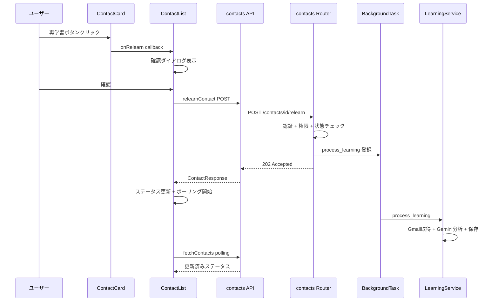
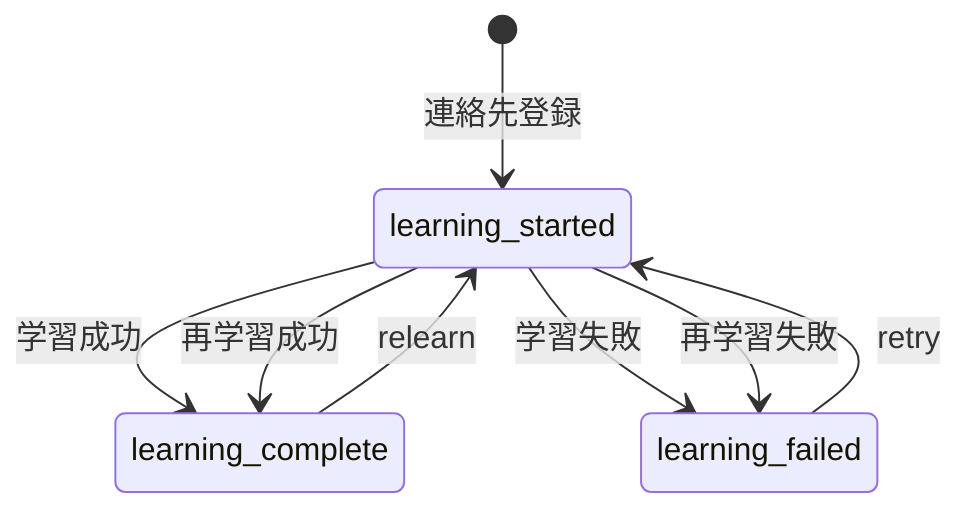

# Design Document: relearn-contact

## Overview

**Purpose**: 学習完了済みの連絡先に対して、最新のメール履歴で学習パターンを再生成する機能を提供する。
**Users**: TogeNuki ユーザーが、時間経過に伴うコミュニケーションパターンの変化を返信生成に反映するために使用する。
**Impact**: 既存の連絡先管理UI（ContactCard/ContactList）にボタンを追加し、バックエンドに新規エンドポイントを1つ追加する。

### Goals
- 学習完了済みの連絡先に対して最新メールでの再学習を可能にする
- 既存の retry（失敗復旧）とは独立した操作として提供する
- 既存アーキテクチャパターン（Router → BackgroundTask → LearningService）を踏襲する

### Non-Goals
- 学習アルゴリズム自体の改善や変更
- 再学習の自動スケジューリング（定期実行）
- 差分学習（前回からの差分メールのみでの更新）

## Architecture

### Existing Architecture Analysis

既存の学習フローは以下のパターンに従う:
- **Router**: リクエスト受信 → バリデーション → BackgroundTasks に処理委譲 → 即座にレスポンス返却
- **LearningService**: Gmail API でメール取得 → Gemini API で分析 → ContactContext に保存
- **ステータス管理**: `is_learning_complete` / `learning_failed_at` フラグで状態遷移

再学習機能はこのパターンをそのまま踏襲する。`LearningService.process_learning` は変更なしで再利用可能。

### Architecture Pattern & Boundary Map



**Architecture Integration**:
- Selected pattern: 既存の Router → BackgroundTask → Service パターンを踏襲
- Domain/feature boundaries: contacts ドメイン内で完結
- Existing patterns preserved: retry エンドポイントと同一の処理フロー
- New components rationale: 新規コンポーネントなし。既存コンポーネントへの追加のみ
- Steering compliance: レイヤードアーキテクチャ（Router → Service → Repository）を維持

### Technology Stack

| Layer | Choice / Version | Role in Feature | Notes |
|-------|------------------|-----------------|-------|
| Frontend | React 19 + TypeScript | 再学習ボタンUI、確認ダイアログ、API呼び出し | 既存コンポーネント拡張 |
| Backend | FastAPI + Python 3.10+ | relearn エンドポイント、BackgroundTasks | 既存パターン踏襲 |
| Data / Storage | Cloud SQL PostgreSQL + SQLAlchemy | ContactContext の削除・再作成 | 既存テーブル利用 |

## Requirements Traceability

| Requirement | Summary | Components | Interfaces | Flows |
|-------------|---------|------------|------------|-------|
| 1.1 | 学習完了時に再学習ボタン表示 | ContactCard | ContactCardProps | - |
| 1.2 | 学習中は再学習ボタン非表示 | ContactCard | ContactCardProps | - |
| 1.3 | 学習失敗時は再学習ボタン非表示 | ContactCard | ContactCardProps | - |
| 2.1 | ボタンクリックで確認ダイアログ | ContactList | - | 再学習フロー |
| 2.2 | 確認後にAPI呼び出し | ContactList, contacts API | relearnContact | 再学習フロー |
| 2.3 | キャンセルで何もしない | ContactList | - | - |
| 2.4 | API呼び出しで学習データ削除・再実行 | contacts Router, LearningService | relearn endpoint | 再学習フロー |
| 2.5 | 完了時にステータス更新 | LearningService, ContactList | - | 再学習フロー |
| 3.1 | 再学習中はボタン無効化 | ContactCard | ContactCardProps | - |
| 3.2 | ポーリングでステータス更新 | ContactList | - | ポーリング |
| 3.3 | 完了後にボタン再有効化 | ContactCard | ContactCardProps | - |
| 3.4 | 画面遷移しても処理継続 | contacts Router, LearningService | - | 再学習フロー |
| 3.5 | ページ復帰時にステータス反映 | ContactList | fetchContacts | ポーリング |
| 4.1 | 失敗時にステータスを学習失敗に設定 | LearningService | - | 再学習フロー |
| 4.2 | ネットワークエラー時にメッセージ表示 | ContactList, contacts API | - | - |
| 4.3 | OAuthトークン無効時のリフレッシュ | LearningService | - | 再学習フロー |
| 5.1 | POST /api/contacts/{id}/relearn 提供 | contacts Router | relearn endpoint | 再学習フロー |
| 5.2 | 所有権検証 | contacts Router | - | - |
| 5.3 | 202 Accepted 返却 | contacts Router | relearn endpoint | - |
| 5.4 | 学習中なら 409 Conflict | contacts Router | relearn endpoint | - |
| 5.5 | 存在しなければ 404 Not Found | contacts Router | relearn endpoint | - |

## Components and Interfaces

| Component | Domain/Layer | Intent | Req Coverage | Key Dependencies | Contracts |
|-----------|-------------|--------|--------------|------------------|-----------|
| ContactCard | UI | 再学習ボタンの条件付き表示 | 1.1-1.3, 3.1, 3.3 | ContactList (P0) | State |
| ContactList | UI | 確認ダイアログ・API呼び出し・ステータス管理 | 2.1-2.3, 2.5, 3.2, 3.5, 4.2 | contacts API (P0) | State |
| contacts API | Frontend/API | relearn API 関数 | 2.2 | Router (P0) | API |
| contacts Router | Backend/Router | relearn エンドポイント | 2.4, 3.4, 5.1-5.5 | LearningService (P0), Repository (P0) | API |
| contact types | Frontend/Types | Contact型（既存、変更なし） | - | - | - |

### Frontend Layer

#### ContactCard

| Field | Detail |
|-------|--------|
| Intent | 学習完了時に再学習ボタンを表示し、学習中は無効化する |
| Requirements | 1.1, 1.2, 1.3, 3.1, 3.3 |

**Responsibilities & Constraints**
- ステータスに応じた再学習ボタンの表示/非表示制御
- 既存の削除・再試行ボタンとの共存

**Dependencies**
- Inbound: ContactList — props 経由でコールバック提供 (P0)

**Contracts**: State [x]

##### State Management
- 表示条件: `contact.status === 'learning_complete'` のとき再学習ボタン表示
- 無効化条件: `contact.status === 'learning_started'` のとき disabled

**Implementation Notes**
- 既存の `onRetry` と同じパターンで `onRelearn` コールバックを props に追加
- ボタンの表示条件は既存の `getLearningStatus` ヘルパーのステータス判定を活用

#### ContactList

| Field | Detail |
|-------|--------|
| Intent | 再学習の確認ダイアログ表示、API呼び出し、ステータス更新を管理 |
| Requirements | 2.1, 2.2, 2.3, 2.5, 3.2, 3.5, 4.2 |

**Responsibilities & Constraints**
- 再学習ボタン押下時の確認ダイアログ表示
- relearn API 呼び出しとレスポンスに基づく contacts state 更新
- 既存ポーリング機能による自動ステータス更新（変更なし）

**Dependencies**
- Outbound: contacts API — `relearnContact` 関数呼び出し (P0)

**Contracts**: State [x]

##### State Management
- `relearnTarget: Contact | null` — 再学習確認ダイアログの対象連絡先
- API 成功時: contacts state 内の該当連絡先をレスポンスデータで差し替え
- エラー時: `error` state にメッセージ設定
- ポーリング: 既存の `hasLearningContacts` 判定で自動的に再学習中もポーリング対象になる

**Implementation Notes**
- 確認ダイアログは既存の `DeleteConfirmDialog` と同じパターンで `RelearnConfirmDialog` を実装
- `handleRelearn` コールバックは既存の `handleRetry` と同じ構造（API呼び出し → state更新）

#### contacts API モジュール

| Field | Detail |
|-------|--------|
| Intent | relearn エンドポイントへの HTTP リクエスト関数を提供 |
| Requirements | 2.2 |

**Contracts**: API [x]

##### API Contract

```typescript
export async function relearnContact(
  idToken: string,
  contactId: string
): Promise<Contact>
```

| Method | Endpoint | Request | Response | Errors |
|--------|----------|---------|----------|--------|
| POST | /api/contacts/{contactId}/relearn | - (body なし) | Contact | 404, 409 |

**Implementation Notes**
- 既存の `retryLearning` と同一の構造（POST、bodyなし、Contact 返却）
- エラーハンドリング: 409 → "この連絡先は現在学習中です", 404 → "連絡先が見つかりません"

### Backend Layer

#### contacts Router（relearn エンドポイント）

| Field | Detail |
|-------|--------|
| Intent | 再学習リクエストの受付、バリデーション、バックグラウンド処理の起動 |
| Requirements | 2.4, 3.4, 5.1, 5.2, 5.3, 5.4, 5.5 |

**Responsibilities & Constraints**
- 認証・認可（Firebase UID → DB ユーザー → 所有権確認）
- 前提条件チェック（学習完了済みであること）
- 既存コンテキスト削除 → ステータスリセット → BackgroundTask 登録

**Dependencies**
- Outbound: contact_repository — コンテキスト削除、ステータス更新 (P0)
- Outbound: LearningService — process_learning バックグラウンド実行 (P0)

**Contracts**: API [x]

##### API Contract

| Method | Endpoint | Request | Response | Errors |
|--------|----------|---------|----------|--------|
| POST | /api/contacts/{contact_id}/relearn | - (path param のみ) | ContactResponse | 401, 403, 404, 409 |

- **前提条件**: `contact.is_learning_complete == True` かつ `contact.learning_failed_at is None`
- **正常処理フロー**:
  1. `get_user_by_firebase_uid` → 401 if not found
  2. `get_contact_by_id` → 404 if not found
  3. `contact.user_id != db_user.id` → 403
  4. `not contact.is_learning_complete` → 409 (`{"error": "not_completed"}`)
  5. `delete_contact_context_by_contact_id`
  6. `update_contact_learning_status(is_complete=False, failed_at=None)`
  7. `session.commit()` + `session.refresh(contact)`
  8. `background_tasks.add_task(LearningService().process_learning, contact_id, user_id)`
  9. return `ContactResponse` with status 202

**Implementation Notes**
- retry エンドポイントと同一構造。主な違いは前提条件チェック（`learning_failed_at` → `is_learning_complete`）
- `learning_failed_at` が設定されている連絡先は retry で対応するため、relearn では拒否しない（失敗状態は retry の責務）

## Data Models

### Domain Model

既存モデルへの変更なし。Contact と ContactContext のリレーションシップをそのまま活用する。

- **Contact**: `is_learning_complete` フラグと `learning_failed_at` タイムスタンプで状態遷移を管理
- **ContactContext**: `learned_patterns` (JSON 文字列) を削除→再作成で再学習を実現

### 状態遷移



### Data Contracts & Integration

**API Data Transfer**: 既存の `ContactResponse` スキーマをそのまま使用。新規スキーマの追加なし。

## Error Handling

### Error Categories and Responses

| Category | Condition | HTTP Status | Response Body | UI 表示 |
|----------|-----------|-------------|---------------|---------|
| User Error | 未認証 | 401 | `{"error": "unauthorized"}` | 認証エラー |
| User Error | 所有権なし | 403 | `{"error": "forbidden"}` | 権限エラー |
| User Error | 連絡先不在 | 404 | `{"error": "not_found"}` | 連絡先が見つかりません |
| User Error | 学習未完了 | 409 | `{"error": "not_completed"}` | この連絡先は現在学習中です |
| System Error | ネットワーク障害 | - | - | エラーメッセージ表示、ステータス変更なし |
| System Error | OAuth トークン失効 | - | - | LearningService 内でリフレッシュ試行→失敗時 learning_failed |
| System Error | Gmail/Gemini API 障害 | - | - | LearningService 内でリトライ(最大3回)→失敗時 learning_failed |

## Testing Strategy

### Unit Tests
- **ContactCard**: ステータス別の再学習ボタン表示/非表示/無効化テスト
- **contacts API**: `relearnContact` 関数の正常系・エラー系テスト
- **contacts Router**: relearn エンドポイントの認証・権限・前提条件テスト

### Integration Tests
- **relearn エンドポイント**: POST → ステータスリセット → BackgroundTask 登録の一連フロー
- **エラーレスポンス**: 404/409 のバリデーション

### E2E/UI Tests
- 学習完了済み連絡先に再学習ボタンが表示される
- 再学習ボタンクリック → 確認ダイアログ → API 呼び出し → ステータス変更
- 学習中・学習失敗の連絡先に再学習ボタンが表示されない
