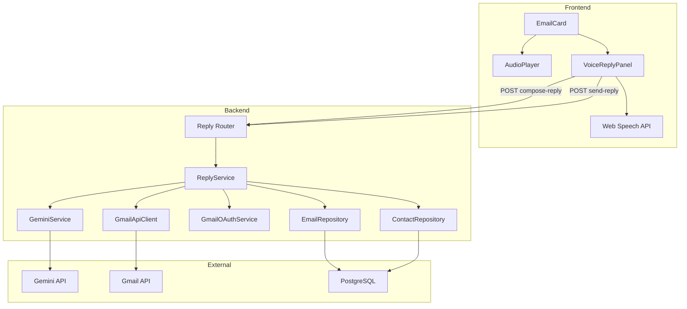
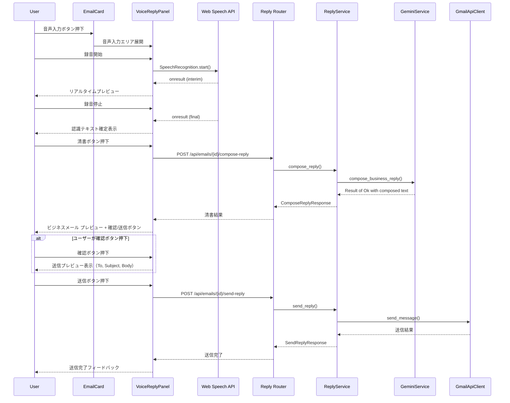

# Design Document: voice-reply-email

## Overview

**Purpose**: ユーザーが口語的に音声で返信内容を伝え、AIがビジネスメールに清書し、Gmail経由で送信する機能を提供する。メール作成の心理的負担と作業コストを大幅に軽減する。

**Users**: リモートワーク環境でメールストレスを抱えるユーザーが、メール一覧画面（/emails）からワンストップで返信を完了するワークフローに利用する。

**Impact**: 既存のEmailCardコンポーネントに音声入力UIを追加し、バックエンドにメール清書・送信サービスを新設する。

### Goals
- EmailCard内の「とげぬき再生」ボタンの隣に音声入力ボタンを配置し、自然な返信フローを実現
- Web Speech API でブラウザ側STT処理を行い、サーバー負荷を軽減
- Gemini API で口語テキストをビジネスメールに清書
- Gmail API で正しいスレッドに紐づけて返信メールを送信
- 「確認」と「送信」を分離し、メールが怖いユーザーも内容を見ずに送信可能にする

### Non-Goals
- メール送信取り消し機能
- 添付ファイル対応
- 複数宛先（CC/BCC）への返信
- 新規メール作成（返信のみ）
- 音声ファイルのサーバー側保存（STTはブラウザ完結）

## Architecture

### Existing Architecture Analysis

現在のシステムは以下の構成で動作している：
- **Frontend**: React SPA（Vite）。EmailCard → AudioPlayer の親子構成でメール一覧・再生を提供
- **Backend**: FastAPI。Router → Service → Repository のレイヤードアーキテクチャ
- **外部サービス**: Gmail API（受信）、Gemini API（ギャル語変換）、Cloud TTS（音声合成）、GCS（音声保存）

本機能は以下を拡張する：
- EmailCard に VoiceReplyPanel コンポーネントを追加
- GeminiService にビジネスメール清書メソッドを追加
- GmailApiClient にメール送信メソッドを追加
- 新規 Router/Service/Schema でメール清書・送信エンドポイントを提供

### Architecture Pattern & Boundary Map



**Architecture Integration**:
- **Selected pattern**: 既存のレイヤードアーキテクチャを踏襲。Router → Service → Repository
- **Domain boundaries**: ReplyService が清書・送信のオーケストレーションを担当。Gemini呼び出し・Gmail送信は既存サービスに委譲
- **Existing patterns preserved**: Result型エラーハンドリング、BackgroundTasksによる非同期処理、Depends()による依存性注入
- **New components rationale**: VoiceReplyPanel（UI責務分離）、ReplyService（返信ビジネスロジック集約）、ReplyRouter（エンドポイント分離）
- **Steering compliance**: サーバーレスアーキテクチャ、非同期処理優先、Result型パターンを維持

### Technology Stack

| Layer | Choice / Version | Role in Feature | Notes |
|-------|------------------|-----------------|-------|
| Frontend | React 19, TypeScript, Vite | 音声入力UI、清書プレビュー、送信確認 | 既存スタック |
| Browser API | Web Speech API (SpeechRecognition) | ブラウザ側音声認識（STT） | Chrome/Edge安定、フォールバック必須 |
| Backend | FastAPI, Python 3.10+ | 清書・送信APIエンドポイント | 既存スタック |
| AI | Gemini 2.5 Flash | 口語→ビジネスメール清書 | 既存 GeminiService を拡張 |
| Email | Gmail API v1 | 返信メール送信 | `gmail.send` スコープ（OAuth済み） |
| Data | PostgreSQL + SQLAlchemy | 送信メール記録 | 既存 Email モデルに `reply_body` カラム追加 |

## System Flows

### 音声入力→清書→送信フロー



## Requirements Traceability

| Requirement | Summary | Components | Interfaces | Flows |
|-------------|---------|------------|------------|-------|
| 1.1 | AudioPlayerの隣に音声入力ボタン表示 | EmailCard, VoiceReplyPanel | — | — |
| 1.2 | 音声入力エリアの展開表示 | VoiceReplyPanel | — | — |
| 1.3 | Web Speech APIで音声認識開始 | VoiceReplyPanel | useSpeechRecognition | 音声入力フロー |
| 1.4 | リアルタイムテキストプレビュー | VoiceReplyPanel | useSpeechRecognition | 音声入力フロー |
| 1.5 | 音声認識停止とテキスト確定 | VoiceReplyPanel | useSpeechRecognition | 音声入力フロー |
| 1.6 | 認識テキストの編集可能表示 | VoiceReplyPanel | — | — |
| 1.7 | 認識テキスト手動編集 | VoiceReplyPanel | — | — |
| 2.1 | Gemini APIで口語→ビジネスメール清書 | ReplyService, GeminiService | compose-reply API | 清書フロー |
| 2.2 | 元メールをコンテキストとして提供 | ReplyService | compose-reply API | 清書フロー |
| 2.3 | contact_contextを考慮した清書 | ReplyService | compose-reply API | 清書フロー |
| 2.4 | 清書結果のプレビュー表示 | VoiceReplyPanel | — | — |
| 2.5 | 清書メール本文の手動編集 | VoiceReplyPanel | — | — |
| 2.6 | 再清書ボタン | VoiceReplyPanel | compose-reply API | 清書フロー |
| 3.1 | Gmail APIでメール送信 | ReplyService, GmailApiClient | send-reply API | 送信フロー |
| 3.2 | In-Reply-To / Referencesヘッダー設定 | ReplyService, GmailApiClient | send-reply API | 送信フロー |
| 3.3 | 送信完了フィードバック | VoiceReplyPanel | — | 送信フロー |
| 3.4 | 送信メールのDB記録 | ReplyService, EmailRepository | — | 送信フロー |
| 3.5 | 送信失敗時のエラー通知・再送信 | VoiceReplyPanel, ReplyService | send-reply API | 送信フロー |
| 4.1 | 確認・送信ボタンの分離表示 | VoiceReplyPanel | — | — |
| 4.2 | 送信ボタン常時有効 | VoiceReplyPanel | — | — |
| 4.3 | 確認ボタンで送信プレビュー表示 | VoiceReplyPanel | — | — |
| 4.4 | 件名のRe:自動設定 | VoiceReplyPanel, ReplyService | compose-reply API | — |
| 4.5 | 戻るボタンで編集画面に戻る | VoiceReplyPanel | — | — |
| 4.6 | 送信ボタンで送信処理開始 | VoiceReplyPanel | send-reply API | 送信フロー |
| 5.1 | Web Speech API不可時のフォールバック | VoiceReplyPanel | — | — |
| 5.2 | 音声認識エラー時の再試行 | VoiceReplyPanel | — | — |
| 5.3 | AI清書失敗時の手動編集維持 | VoiceReplyPanel | — | — |
| 5.4 | OAuthトークン期限切れ時のリフレッシュ | ReplyService | — | — |

## Components and Interfaces

| Component | Domain/Layer | Intent | Req Coverage | Key Dependencies | Contracts |
|-----------|--------------|--------|--------------|------------------|-----------|
| VoiceReplyPanel | Frontend/UI | 音声入力→清書→確認→送信のUIフロー全体を管理 | 1.1-1.7, 2.4-2.6, 3.3, 3.5, 4.1-4.6, 5.1-5.3 | EmailCard (P0), useSpeechRecognition (P0), reply API (P0) | State |
| useSpeechRecognition | Frontend/Hook | Web Speech APIのラッパー。音声認識の開始/停止/結果管理 | 1.3-1.5, 5.1, 5.2 | Web Speech API (P0) | Service |
| ReplyRouter | Backend/Router | 清書・送信エンドポイントの提供 | 2.1, 3.1 | ReplyService (P0), Auth middleware (P0) | API |
| ReplyService | Backend/Service | 清書・送信のオーケストレーション | 2.1-2.3, 3.1-3.2, 3.4, 5.4 | GeminiService (P0), GmailApiClient (P0), OAuthService (P1), Repositories (P1) | Service |
| GeminiService (拡張) | Backend/Service | compose_business_reply メソッド追加 | 2.1-2.3 | Gemini API (P0) | Service |
| GmailApiClient (拡張) | Backend/Service | send_message メソッド追加 | 3.1-3.2 | Gmail API (P0) | Service |

### Frontend

#### VoiceReplyPanel

| Field | Detail |
|-------|--------|
| Intent | 音声入力→清書→確認→送信のUIフロー全体を管理するコンポーネント |
| Requirements | 1.1-1.7, 2.4-2.6, 3.3, 3.5, 4.1-4.6, 5.1-5.3 |

**Responsibilities & Constraints**
- EmailCard の展開コンテンツ内に配置される子コンポーネント
- 音声入力、テキスト編集、清書リクエスト、送信確認、送信実行の全ステートを管理
- Web Speech API の利用不可時はテキスト入力フォールバックを自動提供

**Dependencies**
- Inbound: EmailCard — email props提供 (P0)
- External: Web Speech API — 音声認識 (P0)
- External: Reply API — 清書・送信リクエスト (P0)

**Contracts**: State [x]

##### State Management

```typescript
type ReplyPhase = 'idle' | 'recording' | 'editing' | 'composing' | 'composed' | 'previewing' | 'sending' | 'sent' | 'error';

interface VoiceReplyState {
  phase: ReplyPhase;
  rawText: string;
  composedBody: string;
  composedSubject: string;
  error: string | null;
  isSpeechAvailable: boolean;
}
```

- **State model**: `phase` でUIフローの段階を管理。各フェーズで表示するUI要素を制御
- **Persistence**: ローカルステート（useState）のみ。永続化不要
- **Concurrency**: 単一ユーザー操作のため不要

**Implementation Notes**
- `phase` 遷移: idle → recording → editing → composing → composed → (previewing →) sending → sent
- 「送信」ボタンは `composed` / `previewing` フェーズで常に有効（disabled にしない）
- 「確認」ボタンは `composed` フェーズで表示。押下で `previewing` に遷移
- エラー発生時は直前の `phase` を保持し、再試行可能な状態を維持

#### useSpeechRecognition

| Field | Detail |
|-------|--------|
| Intent | Web Speech API のラッパーhook。音声認識の開始/停止/結果管理を提供 |
| Requirements | 1.3-1.5, 5.1, 5.2 |

**Contracts**: Service [x]

##### Service Interface

```typescript
interface UseSpeechRecognitionReturn {
  isAvailable: boolean;
  isListening: boolean;
  transcript: string;
  interimTranscript: string;
  error: string | null;
  startListening: () => void;
  stopListening: () => void;
  resetTranscript: () => void;
}

function useSpeechRecognition(lang?: string): UseSpeechRecognitionReturn;
```

- Preconditions: ブラウザが `SpeechRecognition` または `webkitSpeechRecognition` をサポート
- Postconditions: `isAvailable: false` の場合、`startListening` は no-op
- Invariants: `isListening` が true の間、`interimTranscript` がリアルタイム更新される

### Frontend API Layer

#### reply API module (`api/reply.ts`)

| Field | Detail |
|-------|--------|
| Intent | 清書・送信APIへのHTTPリクエスト関数を提供 |
| Requirements | 2.1, 3.1 |

**Contracts**: Service [x]

##### Service Interface

```typescript
interface ComposeReplyRequest {
  rawText: string;
}

interface ComposeReplyResponse {
  composedBody: string;
  composedSubject: string;
}

interface SendReplyRequest {
  composedBody: string;
  composedSubject: string;
}

interface SendReplyResponse {
  success: boolean;
  googleMessageId: string;
}

function composeReply(idToken: string, emailId: string, request: ComposeReplyRequest): Promise<ComposeReplyResponse>;
function sendReply(idToken: string, emailId: string, request: SendReplyRequest): Promise<SendReplyResponse>;
```

### Backend

#### ReplyRouter

| Field | Detail |
|-------|--------|
| Intent | メール清書・送信の API エンドポイントを提供 |
| Requirements | 2.1, 3.1 |

**Contracts**: API [x]

##### API Contract

| Method | Endpoint | Request | Response | Errors |
|--------|----------|---------|----------|--------|
| POST | /api/emails/{email_id}/compose-reply | ComposeReplyRequest | ComposeReplyResponse | 400, 404, 500, 503 |
| POST | /api/emails/{email_id}/send-reply | SendReplyRequest | SendReplyResponse | 400, 404, 500, 503 |

**Implementation Notes**
- 両エンドポイントとも `Depends(get_current_user)` でFirebase認証を要求
- `email_id` はパスパラメータ。対象メールの存在と所有権を検証
- 清書エンドポイントは同期的に結果を返却（Gemini API呼び出し含む）
- 送信エンドポイントも同期的に結果を返却（Gmail API呼び出し含む）

#### ReplyService

| Field | Detail |
|-------|--------|
| Intent | 返信メールの清書・送信ビジネスロジックのオーケストレーション |
| Requirements | 2.1-2.3, 3.1-3.2, 3.4, 5.4 |

**Responsibilities & Constraints**
- 元メールの取得、contact_context の取得、Gemini清書呼び出し、Gmail送信の一連のフローを管理
- OAuthトークンのリフレッシュを透過的に処理
- 送信成功時に reply_body をEmailモデルに記録

**Dependencies**
- Inbound: ReplyRouter — HTTPリクエスト処理 (P0)
- Outbound: GeminiService — 清書処理 (P0)
- Outbound: GmailApiClient — メール送信 (P0)
- Outbound: GmailOAuthService — トークンリフレッシュ (P1)
- Outbound: EmailRepository — メール取得・更新 (P1)
- Outbound: ContactRepository — contact_context取得 (P1)

**Contracts**: Service [x]

##### Service Interface

```python
class ReplyError(Enum):
    EMAIL_NOT_FOUND = "email_not_found"
    UNAUTHORIZED = "unauthorized"
    COMPOSE_FAILED = "compose_failed"
    SEND_FAILED = "send_failed"
    TOKEN_EXPIRED = "token_expired"

class ReplyService:
    async def compose_reply(
        self,
        session: AsyncSession,
        user: FirebaseUser,
        email_id: UUID,
        raw_text: str,
    ) -> Result[ComposeReplyResult, ReplyError]: ...

    async def send_reply(
        self,
        session: AsyncSession,
        user: FirebaseUser,
        email_id: UUID,
        composed_body: str,
        composed_subject: str,
    ) -> Result[SendReplyResult, ReplyError]: ...
```

- Preconditions: ユーザーが認証済み、対象メールが存在し所有権あり
- Postconditions: `send_reply` 成功時、Emailモデルの `reply_body` が更新される
- Invariants: OAuthトークンが有効であること（自動リフレッシュ含む）

#### GeminiService（拡張）

| Field | Detail |
|-------|--------|
| Intent | compose_business_reply メソッドを追加。口語テキスト→ビジネスメール清書 |
| Requirements | 2.1-2.3 |

**Contracts**: Service [x]

##### Service Interface

```python
class GeminiService:
    async def compose_business_reply(
        self,
        raw_text: str,
        original_email_body: str,
        sender_name: str,
        contact_context: str | None = None,
    ) -> Result[str, GeminiError]: ...
```

- Preconditions: `raw_text` が空でないこと
- Postconditions: 返却テキストはビジネスメール文体
- system_instruction: ビジネスメール清書用プロンプト（temperature: 0.3）

#### GmailApiClient（拡張）

| Field | Detail |
|-------|--------|
| Intent | send_message メソッドを追加。MIMEメッセージを構築しGmail API経由で送信 |
| Requirements | 3.1-3.2 |

**Contracts**: Service [x]

##### Service Interface

```python
class GmailApiClient:
    async def send_message(
        self,
        to: str,
        subject: str,
        body: str,
        thread_id: str,
        in_reply_to: str,
        references: str,
    ) -> dict[str, Any]: ...
```

- Preconditions: `access_token` が有効であること
- Postconditions: Gmail APIのレスポンス（id, threadId, labelIds）を返却
- MIMEメッセージのbase64urlエンコード、`threadId` の付与を内部で処理

## Data Models

### Domain Model

返信メールは既存の Email エンティティの拡張として管理する。新規テーブルは作成せず、Email モデルにカラムを追加する。

### Logical Data Model

**Email テーブル拡張**:

| Column | Type | Purpose | Notes |
|--------|------|---------|-------|
| reply_body | Text, nullable | 送信した返信メール本文 | 新規追加。NULL = 未返信 |
| reply_subject | Text, nullable | 送信した返信メール件名 | 新規追加 |
| replied_at | DateTime(timezone=True), nullable | 返信送信日時 | 新規追加。NULL = 未返信 |
| reply_google_message_id | String(255), nullable | 返信メールのGmail Message ID | 新規追加 |

**Consistency & Integrity**:
- `reply_body` / `replied_at` は常にペアで設定される（片方だけNULLにはならない）
- 同一メールへの返信は1回のみ（replied_at が NOT NULL の場合は再送信不可）

### Data Contracts & Integration

**API Data Transfer — Pydantic Schemas**:

```python
class ComposeReplyRequest(BaseModel):
    rawText: str = Field(alias="rawText", min_length=1)

class ComposeReplyResponse(BaseModel):
    model_config = ConfigDict(populate_by_name=True)
    composedBody: str
    composedSubject: str

class SendReplyRequest(BaseModel):
    composedBody: str = Field(alias="composedBody", min_length=1)
    composedSubject: str = Field(alias="composedSubject", min_length=1)

class SendReplyResponse(BaseModel):
    model_config = ConfigDict(populate_by_name=True)
    success: bool
    googleMessageId: str
```

## Error Handling

### Error Strategy

既存の Result 型パターンを踏襲し、サービス層でエラーを分類してRouter層で適切なHTTPステータスに変換する。

### Error Categories and Responses

**User Errors (4xx)**:
- `400 Bad Request`: 空テキストでの清書リクエスト、不正なリクエストボディ
- `404 Not Found`: 存在しないメールID、他ユーザーのメール
- `409 Conflict`: 既に返信済みのメールへの再送信

**System Errors (5xx)**:
- `500 Internal Server Error`: DB接続エラー、予期しないエラー
- `503 Service Unavailable`: Gemini API / Gmail API の一時的障害

**Frontend Error Handling**:
- 音声認識エラー: エラーメッセージ表示 + 再試行ボタン
- Web Speech API不可: 自動でテキスト入力フォールバック
- API清書失敗: エラー表示 + テキストエリアの手動編集可能状態を維持
- API送信失敗: エラー表示 + 再送信ボタン

## Testing Strategy

### Unit Tests
- `useSpeechRecognition` hook: 開始/停止/結果取得/エラーハンドリング/フォールバック
- `VoiceReplyPanel`: フェーズ遷移、ボタン表示制御、確認/送信ボタン分離表示
- `GeminiService.compose_business_reply`: 正常清書、contact_context活用、エラーケース
- `ReplyService.compose_reply / send_reply`: オーケストレーション、エラーハンドリング

### Integration Tests
- 清書エンドポイント: 認証→メール取得→Gemini呼び出し→レスポンス
- 送信エンドポイント: 認証→メール取得→Gmail送信→DB更新→レスポンス
- OAuthトークンリフレッシュ: 期限切れトークンの自動更新フロー

### E2E/UI Tests
- 音声入力ボタン押下→録音→停止→テキスト表示→清書→確認→送信の完全フロー
- フォールバック: 音声認識不可時のテキスト入力→清書→送信
- エラーリカバリ: 清書失敗→手動編集→送信
