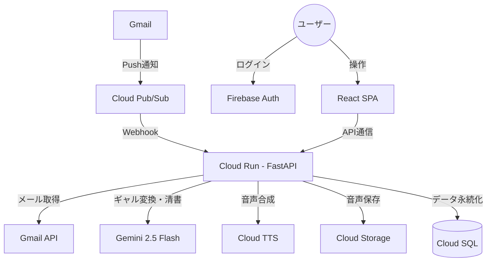

<p align="center">
  
</p>

<p align="center">
  リモートワークでの「メールが怖い」からおさらば！
</p>

---

## TogeNuki とは

**TogeNuki**（トゲヌキ）は、リモートワークでのメールストレスを軽減するAIコミュニケーションツールです。

上司や取引先からの冷淡・威圧的なメールを、AIが**「全肯定してくれるハイテンションなギャル」**の口調と音声に変換して読み上げます。返信はユーザーが口語で音声入力すると、AIが完璧なビジネスメールに清書して送信します。

### コア体験

1. **受信** - 登録済み連絡先からのメール一覧をダッシュボードで確認
2. **視聴** - 再生ボタンを押すと「ねー先輩！部長からマジうける連絡きたんだけど〜！ｗ」とギャル口調で読み上げ
3. **返信** - 「あー、わかった。後でやっとくって言っといて」と音声入力
4. **送信** - AIが「承知いたしました。完了次第直ちに着手いたします。」と清書して送信

## アーキテクチャ



## 技術スタック

| 領域 | 技術 |
|------|------|
| **フロントエンド** | React 19, TypeScript, Vite |
| **バックエンド** | Python 3.10+, FastAPI, SQLAlchemy |
| **AI** | Gemini 2.5 Flash (感情変換・返信清書), Google Cloud TTS (音声合成) |
| **認証** | Firebase Authentication, Gmail OAuth |
| **インフラ** | Cloud Run, Cloud SQL (PostgreSQL), Cloud Pub/Sub, Cloud Storage |
| **IaC** | Terraform |

## プロジェクト構成

```
togenuki/
├── apps/
│   ├── web/           # React フロントエンド
│   └── api/           # FastAPI バックエンド
├── infrastructures/   # Terraform (GCPリソース)
├── scripts/           # ユーティリティスクリプト
├── docs/              # ドキュメント
└── assets/            # ブランドアセット
```

各アプリケーションの詳細は以下を参照してください。

- [apps/web/README.md](apps/web/README.md) - フロントエンド
- [apps/api/README.md](apps/api/README.md) - バックエンド

## セットアップ

### 前提条件

- Node.js 18+
- Python 3.10+
- Google Cloud プロジェクト（Cloud Run, Cloud SQL, Pub/Sub, Cloud Storage, Cloud TTS 有効化済み）
- Firebase プロジェクト（Authentication 有効化済み）
- Gmail API の OAuth クレデンシャル

### 1. リポジトリのクローン

```bash
git clone <repository-url>
cd togenuki
```

### 2. フロントエンドのセットアップ

```bash
cd apps/web
npm install
cp .env.example .env  # 環境変数を設定
npm run dev
```

### 3. バックエンドのセットアップ

```bash
cd apps/api
uv venv
source .venv/bin/activate
uv pip install -e ".[dev]"
cp .env.example .env  # 環境変数を設定
uvicorn src.main:app --reload
```

### 4. インフラのプロビジョニング

```bash
cd infrastructures
terraform init
terraform plan
terraform apply
```

## 開発コマンド

```bash
# フロントエンド (apps/web/)
npm run dev          # 開発サーバー起動
npm run build        # プロダクションビルド
npm run test:run     # テスト実行
npm run check        # lint + format チェック

# バックエンド (apps/api/)
uvicorn src.main:app --reload   # 開発サーバー起動
pytest                          # テスト実行
ruff check src/                 # lint
```

## ライセンス

Private
