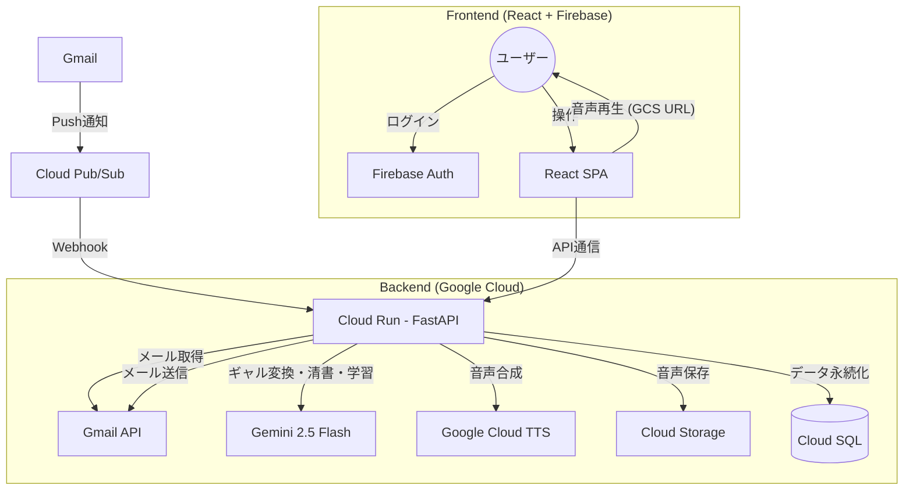

## デモ動画

<!-- TODO: YouTube動画のURLを貼り付け -->

@[youtube](VIDEO_ID)

## GitHubリポジトリ

https://github.com/takkuhiro/togenuki

---

## はじめに

リモートワークが当たり前になった時代。

ある会社員の日常。上司からの催促メールが飛び交う。相手の顔が見えない。声のトーンもわからない。想像するしかない。

「メールが怖い」

受信音が鳴るだけで体がこわばる。メールを開くことができない。手が震える。
意を決してメールを開いても、目で文字を追うことはできても頭で理解することができない。
呼吸が浅くなる。会社を休むにしても、休む連絡のメールすら書けない。

そして何もできなくなる。

**こうならないために、TogeNukiを作りました。**

（このストーリーはフィクションですが、リモートワーク環境でメールに苦しんでいる人は決して少なくありません。）

---

## 課題 — リモートワーク時代の「見えないストレス」

### テキストコミュニケーションの構造的問題

対面のコミュニケーションでは、相手の「表情」「声のトーン」「身振り」から真意を読み取ることができます。

しかしメールやチャットなどのテキストコミュニケーションでは、これらの情報が一切ありません。受け手は限られた文字情報だけで相手の感情を推測するしかなく、**ネガティブに深読みしてしまう**傾向があります。

特に上司からの「至急対応お願いします。」「進捗はどうなっていますか。」といった短い文面は、対面では何気ない確認であっても、テキストだけでは威圧的に感じてしまいます。

**リモートワークうつは「真面目で責任感が強い人」ほど陥りやすい**と言われています。相手の姿が見えない分、自分を追い込んでしまうのです。

### 既存ツールでは解決できない

この問題に対して、既存のアプローチでは根本的な解決ができません。

- **メールクライアントの改善** — UIをどれだけ洗練させても、テキストの「冷たさ」は変わりません。これはUIの問題ではなく、テキストという媒体そのものの問題です。
- **チャットツールへの移行** — SlackやTeamsに移行しても、テキストである限り本質は同じです。むしろ即時性が増すことで、プレッシャーが強まることもあります。
- **メンタルヘルスアプリ** — ストレスを受けた後のケアは重要ですが、事後対処であり、「メールを開く」というストレスの発生源には手が届きません。

### 本当に必要なもの

精神的に辛い状態にある人にとって、**「メールを開く」という行為自体が最大のハードル**です。画面遷移すら億劫な状態で、長文のビジネスメールを読み、適切な返信を考え、丁寧な文体で書くことは、想像以上の負荷です。

必要なのは「メールともっと上手に付き合うための仕組み」ではなく、**「メールと直接向き合わなくていい仕組み」**です。

---

## ソリューション — TogeNukiの提案

### コンセプト：メールのトゲを抜く

**TogeNuki**は、上司や取引先からの冷淡・威圧的なメールを、AIが**「全肯定してくれるハイテンションなギャル」**の口調と音声に変換して読み上げるAIコミュニケーションツールです。

ユーザーはメールを直接開く必要がありません。TogeNukiがメールの「トゲ」を抜いて、優しく伝えてくれます。返信も音声で伝えるだけ。AIが完璧なビジネスメールに清書して送信します。

### コア体験

TogeNukiの体験は、たった4つのステップで完結します。

**1. 受信** — ダッシュボードを開くと、事前に登録した連絡先からのメール一覧が表示されます。メールの原文は直接表示されません。

**2. 視聴** — 再生ボタンを押すと、AIがギャル口調に変換した音声が流れます。

> 「ねー先輩！部長からマジうける連絡きたんだけど〜！ｗ なんか金曜までに資料まとめてほしいんだって〜。先輩なら余裕っしょ！✨」

**3. 返信** — ユーザーはマイクボタンを押して、思ったことをそのまま口にします。

> 「あー、わかった。後でやっとくって言っといて」

**4. 送信** — AIがビジネスメールに清書して送信します。

> 「承知いたしました。只今別件の対応中ですので、完了次第直ちに着手いたします。」

ユーザーがメールの原文を直接読むことも、キーボードでビジネスメールを書くこともありません。**数クリックと音声入力だけで、メールのやり取りが完了します。**

### なぜ「ギャル」なのか

一見ふざけているように見えるこのアプローチには、根拠があります。

**認知的再評価（cognitive reappraisal）**。心理学において、同じ出来事でも「受け取り方」を変えることでストレス反応を低減できることが知られています。威圧的な文面も、ハイテンションなギャルが「マジうけるｗ」と伝えてくれるだけで、受け取り方が変わります。

また、**第三者が「味方」として間に入る**ことで、ユーザーと威圧的なメールの間に心理的なバッファが生まれます。直接攻撃されるのではなく、味方が「こんなこと言ってるよ〜」と教えてくれる構図です。

さらに、**ユーモアにはストレス軽減効果**があります。深刻な内容を深刻なまま受け取るのではなく、少し笑えるかたちに変換することで、心理的な負荷を大幅に下げることができます。

そしてギャルの「全肯定」というキャラクター性。どんな状況でも「先輩なら大丈夫！」と言ってくれる存在は、自己肯定感が低下した状態にある人にとって、想像以上に効果的です。

---

## 機能詳細 — 3つのコア機能

### 1. メール受信 → ギャル語変換 → 音声読み上げ

TogeNukiの中核となる機能です。

ユーザーが事前に登録した連絡先からメールが届くと、GmailのPush通知（Cloud Pub/Sub経由）でバックエンドがリアルタイムに検知します。バックエンドはGmail APIでメール本文を取得し、**Gemini 2.5 Flash**でギャル口調に変換。変換されたテキストを**Google Cloud Text-to-Speech**で音声合成し、Cloud Storageに保存します。

ユーザーがダッシュボードを開いたときには、すでに音声が準備されています。再生ボタンを押すだけで、ギャルがメールの内容を伝えてくれます。

原文は「袋とじ」のように隠されており、見たい人だけが展開して確認できます。**見たくなければ、一度も原文を目にすることなくメールのやり取りを完了できます。**

### 2. 連絡先管理 & 学習機能

TogeNukiでは、監視したい連絡先（上司や取引先など）を事前に登録します。

連絡先の登録時に、**過去のメール履歴（最大30件）をAIが分析**します。「相手のメールの特徴」（語調、よく使う表現、要求パターンなど）と「ユーザー自身の返信パターン」（文体の癖、対応スタイルなど）を学習し、データベースに保存します。

この学習データは、返信メールの生成時に活用されます。つまり、AIが書く返信メールは汎用的なビジネステンプレートではなく、**ユーザーが普段書いているメールの文体に近い、自然な返信**になります。「AIが書いた感」を極力排除し、相手にバレるリスクを下げます。

### 3. 音声入力による返信メール生成・送信

返信はすべて音声で完結します。

ユーザーがマイクボタンを押して話すと、**ブラウザのWeb Speech API**が音声をテキストに変換します。この変換はブラウザ上で完結するため、サーバーへの音声データ送信は不要です。

変換されたテキスト（口語表現）は、バックエンドで**Gemini 2.5 Flash**がビジネスメールに清書します。このとき、連絡先ごとに学習されたコンテキスト（相手の特徴とユーザーの返信パターン）が参照され、相手との関係性に合った文体で返信が生成されます。

送信前には確認画面で宛先・件名・本文をプレビューできます。問題なければ送信ボタンを押すだけ。Gmail APIを通じて、元のメールスレッドに紐づいた返信として送信されます。

### こだわり：最小限の労力

精神的に辛い状態にあるユーザーにとって、**操作の少なさは最も重要なUX要件**です。

TogeNukiでは、メールの確認から返信送信まで**画面遷移が一切ありません**。すべてがダッシュボード上で完結します。再生ボタン、マイクボタン、送信ボタン。必要な操作は数クリックと音声入力だけです。

---

## システムアーキテクチャ

### 全体構成

### 技術スタック

| 領域 | 技術 | 選定理由 |
| --- | --- | --- |
| **フロントエンド** | React 19 / TypeScript / Vite | 高速な開発体験とモダンなUI構築 |
| **バックエンド** | FastAPI / Python 3.10+ / SQLAlchemy | 非同期処理に強く、AI系ライブラリとの親和性が高い |
| **AI（LLM）** | Gemini 2.5 Flash | 高速・低コスト。感情変換、ビジネス清書、学習分析の3役を担う |
| **AI（TTS）** | Google Cloud Text-to-Speech | 日本語の自然な音声合成。Wavenet / Neural2による高品質な読み上げ |
| **AI（STT）** | Web Speech API | ブラウザ側で完結。サーバーコスト・通信コストゼロ |
| **認証** | Firebase Authentication / Gmail OAuth | Google Sign-Inで統一。Gmail APIアクセス権限も同時取得 |
| **データベース** | Cloud SQL（PostgreSQL） | リレーショナルデータの管理。学習データやメール履歴の永続化 |
| **ストレージ** | Cloud Storage | 音声ファイル（.mp3）の保存・配信 |
| **メッセージング** | Cloud Pub/Sub | Gmailからのリアルタイム通知受信 |
| **インフラ** | Cloud Run / Terraform | サーバーレスコンテナでコスト最適化。IaCで再現性確保 |

### 主要な技術的判断

**Google Cloud一本化** — 認証（Firebase）、LLM（Gemini）、音声合成（Cloud TTS）、メール（Gmail API）、インフラ（Cloud Run / Cloud SQL）のすべてをGoogle Cloudのエコシステム内で統一しています。サービス間の連携がシンプルになり、認証情報の管理も一元化できます。

**音声認識のブラウザ側処理** — 音声からテキストへの変換をサーバーではなくブラウザのWeb Speech APIで行います。音声データをサーバーに送信する必要がなく、サーバーコストと通信量を削減しています。

**非同期バックグラウンド処理** — メール受信時のPub/Sub Webhookに対して即座にHTTP 200を返却し、重い処理（メール取得→ギャル変換→音声合成→保存）はFastAPIのBackgroundTasksで非同期に実行します。Pub/Subのタイムアウトに引っかからず、確実にメールを処理できます。

**学習データによるパーソナライズ** — 連絡先ごとに過去のメールパターンを分析・保存し、返信生成時にコンテキストとして渡すことで、ユーザー固有の文体を再現します。汎用的なAI返信ではなく、「その人らしい」返信を生成するための仕組みです。

---

## おわりに

TogeNukiで目指しているのは、**「ユーザーが普通にメールを書けるようになること」**です。

AIを使ったプロダクトというと、「人間の仕事を代替する」「生産性を上げる」といった文脈で語られがちです。しかしTogeNukiが目指すのは、もっと手前にある——**「メールを開くことすらできない人が、もう一度普通の生活を取り戻すこと」**です。

AIの力は、人間の代わりに仕事をするためだけのものではありません。**人間の心を守るためにも使える**。TogeNukiはそのことを証明するプロダクトでありたいと思っています。

将来的には、ギャル以外のキャラクターの選択や、メール以外のコミュニケーションツール（Slack、Teamsなど）への展開も視野に入れています。「テキストが怖い」と感じるすべての人に、TogeNukiが届くように。
